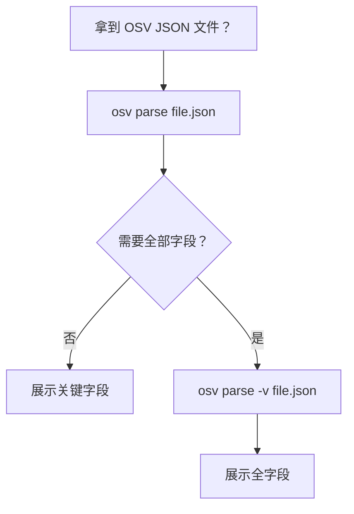
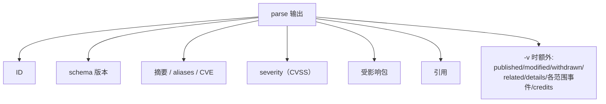
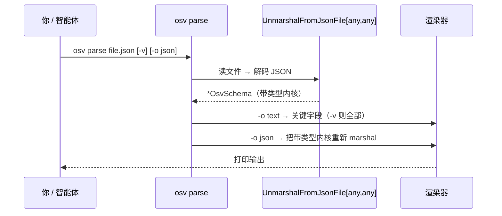
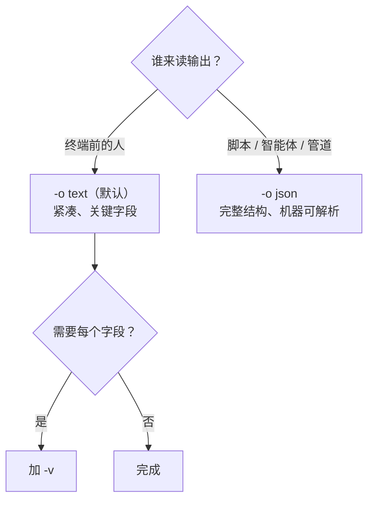

# osv-parse

解析 OSV JSON 文件并展示结构化的漏洞数据。

> **触发条件：** 提到 OSV 解析、漏洞 JSON 读取、CVE/GHSA 数据提取，或用户提供了 OSV JSON 文件路径。
> **技能源码：** [`.claude/skills/osv-parse/SKILL.md`](https://github.com/scagogogo/osv-schema-skills/blob/main/.claude/skills/osv-parse/SKILL.md)

## CLI

```bash
osv parse vulnerability.json           # 关键字段（文本）
osv parse -v vulnerability.json        # 全字段（日期、详情、范围、鸣谢）
osv parse -o json vulnerability.json   # JSON 输出
```

| 标志 | 说明 |
|------|------|
| `-v, --verbose` | 展示全字段 |
| `-o, --output` | `text`（默认）或 `json` |

## SDK 等价

```go
v, err := osv.UnmarshalFromJsonFile[any, any]("vulnerability.json")
fmt.Println(v.ID, v.Summary, v.Aliases.GetCVE())
```

## 决策树



## 输出结构



## 它打印什么

ID、schema 版本、摘要、aliases/CVE、severity、受影响包、引用。加 `-v` 还会展示 published/modified 日期、withdrawn、related、details、每范围事件和 credits。

## 底层发生了什么

`osv parse` 只是 SDK `UnmarshalFromJsonFile` 之上的一层薄壳——和你在 Go 里会写的调用一模一样。与 SDK 路径唯一的区别就是文本/JSON 的渲染。



## 文本 vs JSON：怎么选



`-o json` 把带类型的 `OsvSchema` 内核重新 marshal，所以输出就是标准 OSV 记录——字段名与 [OSV Schema](/zh/reference/osv-schema) 完全一致：

```bash
osv parse -o json vulnerability.json | jq '{id, summary, severity, affected}'
```

```json
{
  "id": "GHSA-vxv8-r8q2-63xw",
  "summary": "TensorFlow vulnerable to `CHECK` fail in `FractionalMaxPoolGrad`",
  "severity": [{ "type": "CVSS_V3", "score": "CVSS:3.1/AV:N/AC:H/PR:N/UI:N/S:U/C:N/I:N/A:H" }],
  "affected": [{ "package": { "ecosystem": "PyPI", "name": "tensorflow", "purl": "" }, "ranges": [...] }]
}
```

::: tip 解析绝不修改文件
`parse` 只读。它把数据解码进带类型内核再打印——绝不写回。想在解析前先确认文件*格式正确*，用 [[osv-validate]]；格式错误的文件会让 `parse` 以非零码退出并给出解码错误。
:::

## 交叉引用

- [[osv-validate]] — 先确认文件 schema 合规
- [[osv-filter]] / [[osv-query]] — 对解析后的数据做收窄或提取
