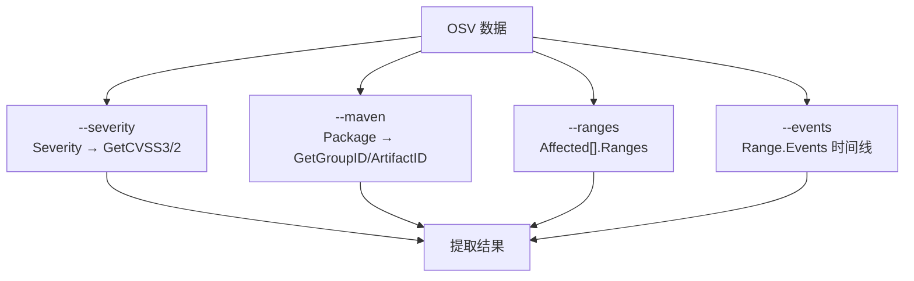
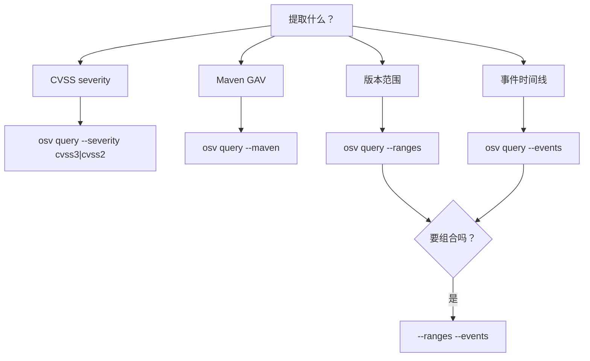
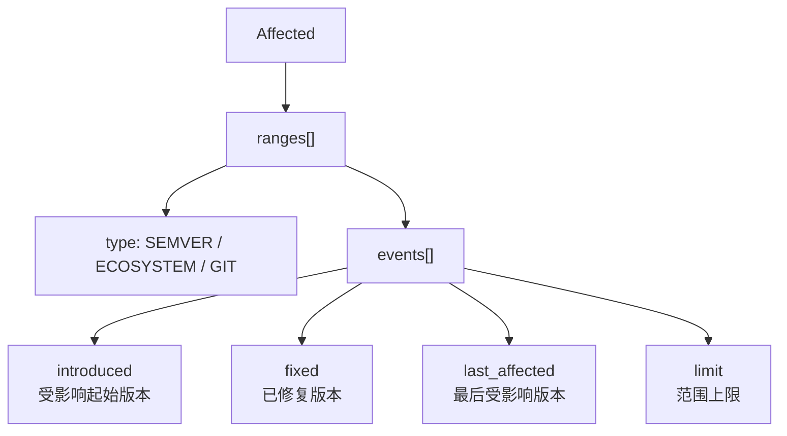
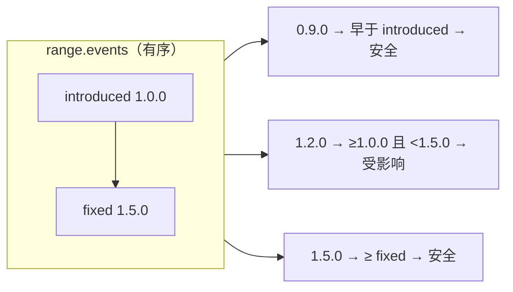

# osv-query

提取特定子信息：CVSS severity、Maven 拆分、版本范围、事件时间线。

> **触发条件：** 查询 CVSS 分数、Maven groupId/artifactId、版本范围，或从 OSV 数据中聚焦提取。
> **技能源码：** [`.claude/skills/osv-query/SKILL.md`](https://github.com/scagogogo/osv-schema-skills/blob/main/.claude/skills/osv-query/SKILL.md)

## CLI

```bash
osv query --severity cvss3 vulnerability.json  # CVSS v3 条目 + 解析分数（向量串时为 0.0）
osv query --severity cvss2 vulnerability.json  # CVSS v2
osv query --maven vulnerability.json           # Maven groupId/artifactId
osv query --ranges vulnerability.json          # 版本范围
osv query --events vulnerability.json          # 事件时间线
osv query --ranges --events vulnerability.json # 组合
```

| 标志 | 说明 |
|------|------|
| `--severity` | `cvss3` 或 `cvss2` |
| `--maven` | 拆分 Maven `groupId:artifactId` |
| `--ranges` | 显示版本范围 |
| `--events` | 显示事件时间线 |
| `-o, --output` | `text`（默认）或 `json` |

至少需要一个标志。

`--severity -o json` 返回 CVSS 条目。`score` 是原始向量字符串；DTO 也会经 `GetScore()` 算一个 `numeric_score`，但它带 `omitempty`——而向量字符串时 `GetScore()` 返回 `0.0`，于是该字段被从 JSON 里省略。文本模式下同一个 `0.0` 仍会打印为 `Numeric score: 0.0`，所以同一条记录下该字段在文本里出现、在 JSON 里消失：

```bash
osv query --severity cvss3 -o json test_data/GHSA-vxv8-r8q2-63xw.json
```

```json
{
  "id": "GHSA-vxv8-r8q2-63xw",
  "severity": {
    "type": "CVSS_V3",
    "score": "CVSS:3.1/AV:N/AC:H/PR:N/UI:N/S:U/C:N/I:N/A:H"
  }
}
```

`--maven -o json` 把每个 Maven 包名拆成 `group_id` / `artifact_id`（按首个 `:` 拆分）。非 Maven 包会被跳过——只有 `Maven` 生态的条目出现：

```bash
osv query --maven -o json maven-record.json
```

```json
{
  "id": "GHSA-maven-example",
  "maven": [
    {
      "name": "org.apache.commons:commons-text",
      "group_id": "org.apache.commons",
      "artifact_id": "commons-text"
    }
  ]
}
```

## 四个提取维度



## SDK 等价

```go
// Severity
if s := v.Severity.GetCVSS3(); s != nil { fmt.Println(s.GetScore()) }

// Maven
for _, a := range v.Affected {
    if a.Package.IsMaven() {
        fmt.Println(a.Package.GetGroupID(), a.Package.GetArtifactID())
    }
}

// Ranges & events
for _, a := range v.Affected {
    for _, r := range a.Ranges {
        for _, e := range r.Events {
            // e.IsIntroduced() / IsFixed() / IsLastAffected() / IsLimit()
        }
    }
}
```

## 决策树



## 版本范围与事件的关系



事件字段在每个 event 对象里互斥——一个 event 只会是 introduced/fixed/last_affected/limit 之一。`-o json` 输出把这层可视化了：每个 event 对象只携带它那一个非空字段（`omitempty` 剥掉了其余字段）：

```bash
osv query --events -o json test_data/GHSA-vxv8-r8q2-63xw.json
```

```json
{
  "events": [
    { "package": "PyPI/tensorflow", "introduced": "0" },
    { "package": "PyPI/tensorflow", "fixed": "2.7.2" },
    { "package": "PyPI/tensorflow", "introduced": "2.8.0" },
    { "package": "PyPI/tensorflow", "fixed": "2.8.1" }
  ]
}
```

## `--events` 时间线实例

`--events` 打印的是原始有序事件。要把它变成对某个具体版本的是/否回答，就按顺序遍历。下面是 `introduced: 1.0.0` 接着 `fixed: 1.5.0`，对三个候选版本的判定：



::: tip CLI 给你数据，不给结论
`osv query --events` 有意止步于原始时间线——它从不判定"版本 X 是否受影响"，因为那需要生态感知的版本比较（见 [RangeType](/zh/reference/osv-schema#rangetype-——-版本如何比较)）。上面的遍历是*你*在逐事件谓词之上自行实现的部分。
:::

## 注意事项

- `GetCVSS3()` / `GetCVSS2()` 在 severity 类型缺失时返回 `nil`
- 当 OSV 的 `score` 是 CVSS 向量字符串而非数字时，`GetScore()` 返回 `0.0`——错误处理用 `GetScoreAsFloat()`
- Maven 拆分只适用于 `Maven` 生态的包
- 事件字段互斥：每个 event 对象只有 `introduced`/`fixed`/`last_affected`/`limit` 之一

## 交叉引用

- [[osv-parse]] — 先完整解析
- [[osv-severity]] — 更深的 severity 分析
- [[osv-affected]] — 更深的 affected/range 分析
