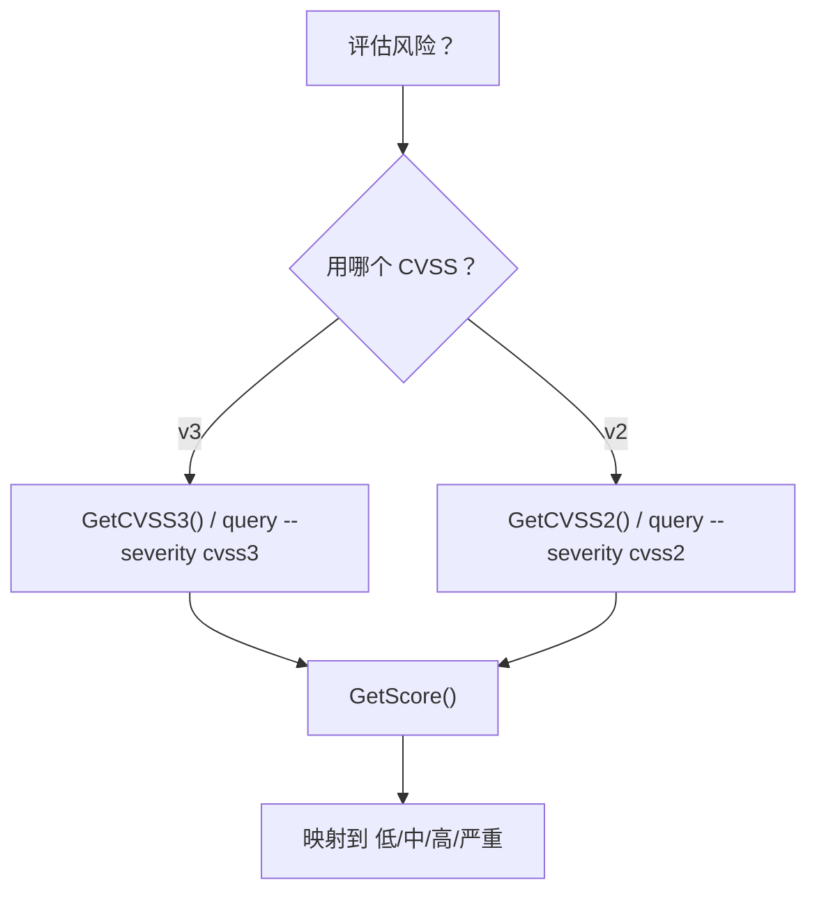
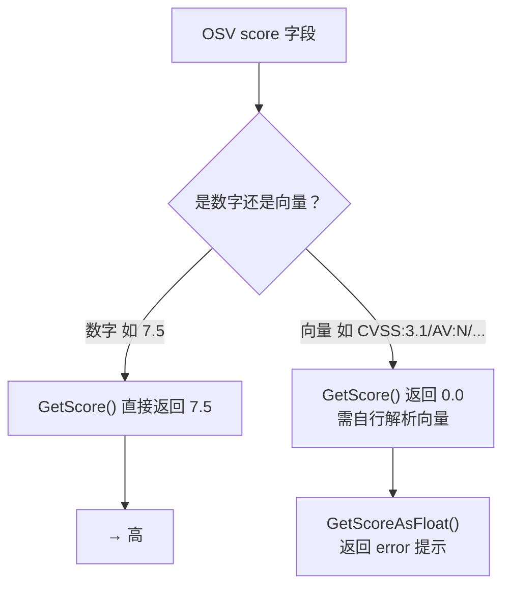
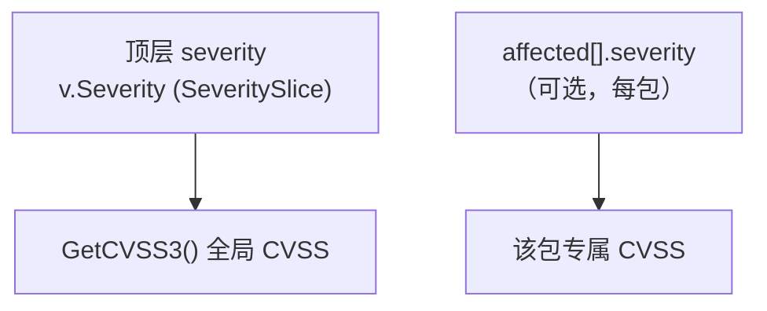
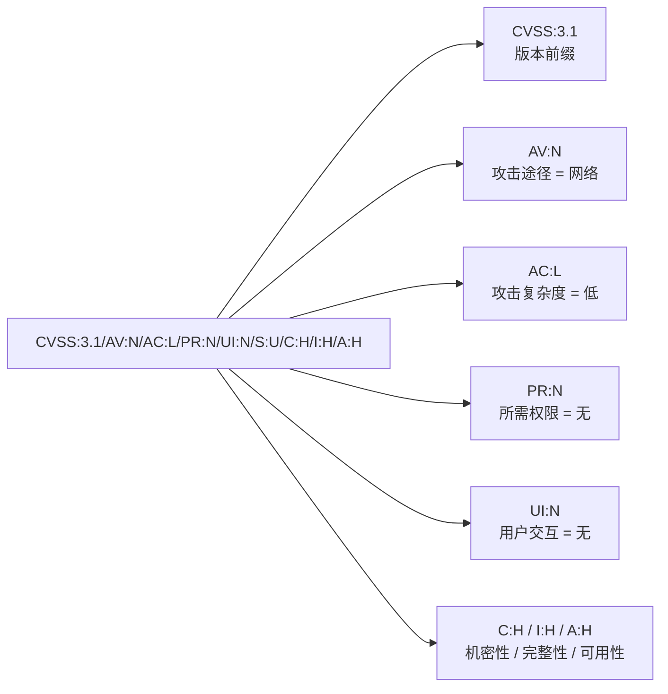

# osv-severity

分析 OSV 记录中的 CVSS severity 数据。

> **触发条件：** 提到 CVSS 分数、漏洞 severity 评估、风险评级，或评估影响。
> **技能源码：** [`.claude/skills/osv-severity/SKILL.md`](https://github.com/scagogogo/osv-schema-skills/blob/main/.claude/skills/osv-severity/SKILL.md)

## CLI

severity 经由 `osv query` 查询：

```bash
osv query --severity cvss3 vulnerability.json  # CVSS v3 条目 + 解析分数（向量串时为 0.0）
osv query --severity cvss2 vulnerability.json  # CVSS v2
```

或用 `osv parse -v` 一次看全部 severity。

## SDK

```go
// CVSS v3 条目（缺失则为 nil——使用前先检查）
s := v.Severity.GetCVSS3()
if s == nil {
    return // 无 CVSS v3 条目
}

// 解析后的数值分数
fmt.Println(s.GetScore())        // float64，无法解析时为 0.0
score, err := s.GetScoreAsFloat() // 带 error
ptr := s.GetScoreAsPointer()     // *float64，出错时为 nil
```

## CVSS 分数对照表

| 分数区间 | 严重程度 |
|----------|----------|
| 0.1–3.9 | 低（Low） |
| 4.0–6.9 | 中（Medium） |
| 7.0–8.9 | 高（High） |
| 9.0–10.0 | 严重（Critical） |

## 决策树



## 从向量到分数的解析路径



## 顶层 vs 包级 severity



`affected[].severity` 是可选的每包 severity，与顶层 `severity` 相互独立。

## CVSS 向量结构剖析

当 `score` 是向量字符串而非数字时，这些用斜杠分隔的记号就是它们的含义——也正是 `GetScore()` 不能直接 `ParseFloat` 的原因。



::: tip 向量转数值需要 CVSS 计算器
0–10 的数值分数是由这些指标通过 CVSS 公式*推导*出来的，并不存在字符串里。所以 SDK 把向量原样交给你，把打分留给专门的 CVSS 库——OSV 记录本身只保证给出向量。
:::

## 注意事项

- OSV 的 `score` 可能是 CVSS 向量字符串（`CVSS:3.1/AV:N/...`）而非数字——此时 `GetScore()` 返回 `0.0`。若需从向量取数值分数，请自行解析向量。
- `SeverityTypeCVSS2 = "CVSS_V2"`，`SeverityTypeCVSS3 = "CVSS_V3"`

## 交叉引用

- [[osv-query]] — `--severity` 标志在这里
- [[osv-affected]] — 每包 severity（`affected[].severity`）
- [方法清单](/zh/reference/methods#severity) — 完整 severity API
