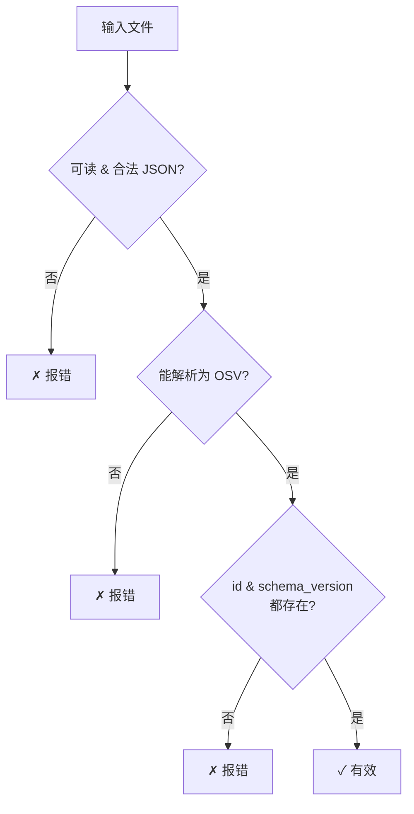
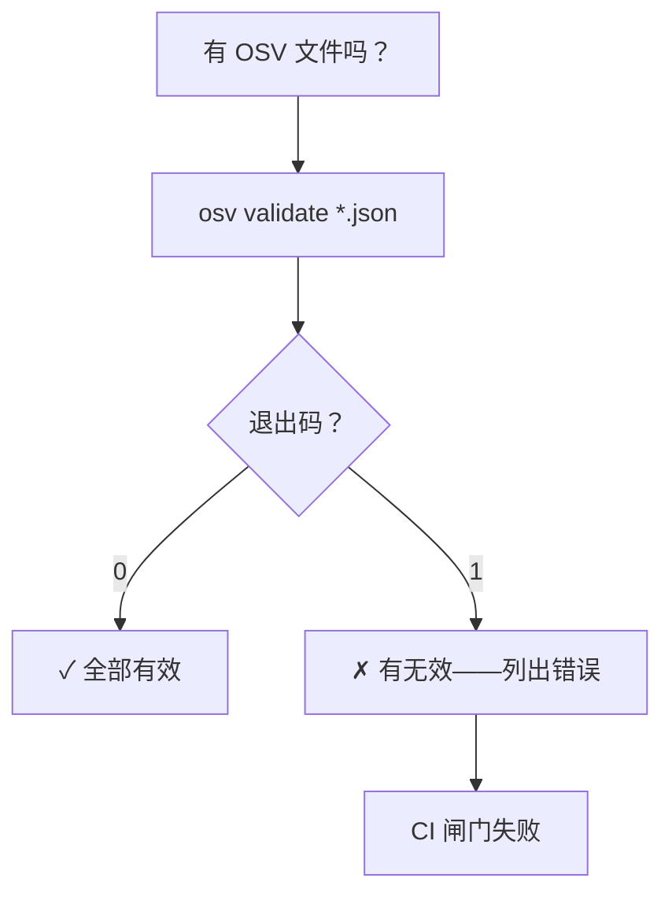
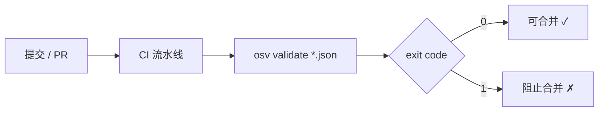

# osv-validate

校验 OSV JSON 文件是否符合 schema。

> **触发条件：** 提到 OSV 校验、漏洞格式检查、schema 合规性，或验证文件是否规范。
> **技能源码：** [`.claude/skills/osv-validate/SKILL.md`](https://github.com/scagogogo/osv-schema-skills/blob/main/.claude/skills/osv-validate/SKILL.md)

## CLI

```bash
osv validate vulnerability.json              # 单文件
osv validate file1.json file2.json           # 批量
osv validate -o json vulnerability.json      # JSON 输出
```

若有文件无效则以退出码 `1` 退出——对 CI 友好。

| 标志 | 说明 |
|------|------|
| `-o, --output` | `text`（默认）或 `json` |

## 它检查什么

- 文件可读且是合法 JSON
- 能作为 OSV 解析（`UnmarshalFromJson`）
- 必需字段存在：`id` 和 `schema_version`

## 校验流程



## 决策树



## 在 CI 中的位置



## SDK 等价

```go
raw, _ := os.ReadFile("vulnerability.json")
if !json.Valid(raw) { /* 不是 JSON */ }
v, err := osv.UnmarshalFromJson[any, any](raw)
// 然后检查 v.ID != "" && v.SchemaVersion != ""
```

## 交叉引用

- [[osv-parse]] — 展示有效文件的内容
- [[osv-installation]] — 先安装 CLI
