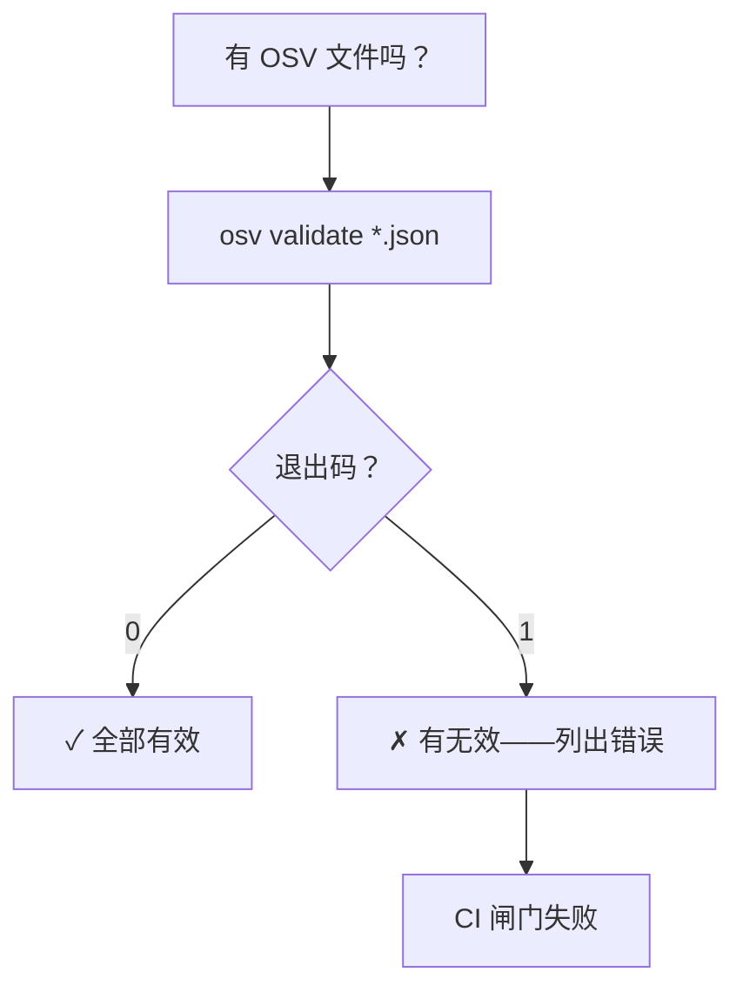
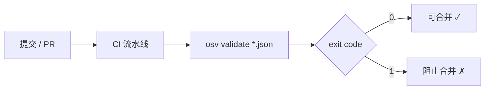
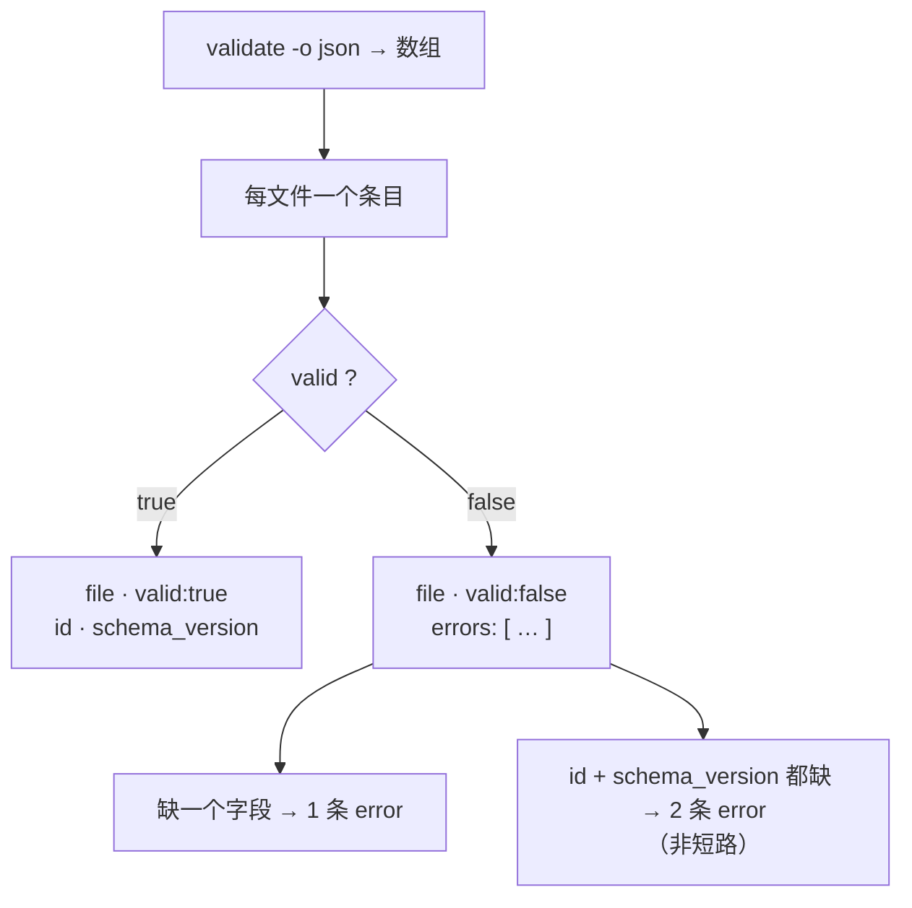
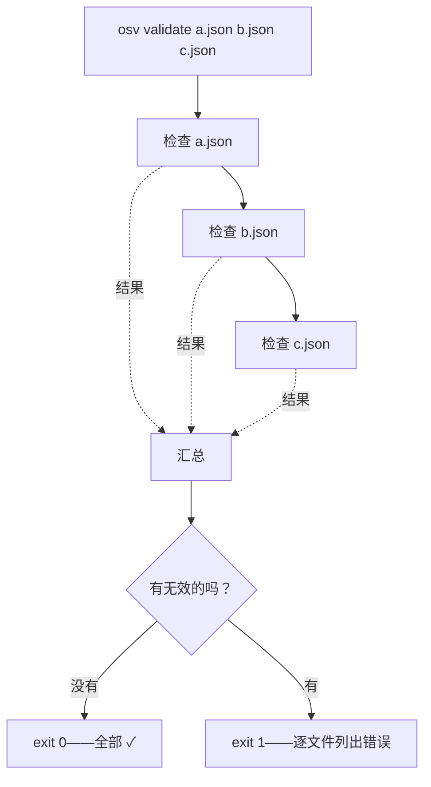

# osv-validate

校验 OSV JSON 文件是否符合 schema。

> **触发条件：** 提到 OSV 校验、漏洞格式检查、schema 合规性，或验证文件是否规范。
> **技能源码：** [`.claude/skills/osv-validate/SKILL.md`](https://github.com/scagogogo/osv-schema-skills/blob/main/.claude/skills/osv-validate/SKILL.md)

## CLI

```bash
osv validate vulnerability.json              # 单文件
osv validate file1.json file2.json           # 批量
osv validate -o json vulnerability.json      # JSON 输出
```

若有文件无效则以退出码 `1` 退出——对 CI 友好。

默认文本输出按文件用 `✓`/`✗` 标记，成功时附上解析出的 `id` 和 `schema_version`，失败时列出错误要点（一条同时缺 id 和 schema_version 的记录会列出两条，因为检查不短路）：

```text
✓ test_data/GHSA-vxv8-r8q2-63xw.json (id=GHSA-vxv8-r8q2-63xw, schema_version=1.4.0)
✗ bad.json
  - missing required field: id
  - missing required field: schema_version
```

| 标志 | 说明 |
|------|------|
| `-o, --output` | `text`（默认）或 `json` |

## 它检查什么

- 文件可读且是合法 JSON
- 能作为 OSV 解析（`UnmarshalFromJson`）
- 必需字段存在：`id` 和 `schema_version`

## 校验流程

```mermaid
flowchart TD
  F["输入文件"] --> R{"可读 & 合法 JSON?"}
  R -->|"否"| E1["✗ 报错"]
  R -->|"是"| P{"能解析为 OSV?"}
  P -->|"否"| E2["✗ 报错"]
  P -->|"是"| ID{"id != \"\" ？"}
  ID -->|"否"| E3["+ 错误：缺失 id"]
  ID -->|"是"| SV{"schema_version != \"\" ？"}
  SV -->|"否"| E4["+ 错误：缺失 schema_version"]
  SV -->|"是"| OK["✓ 有效"]
  E3 --> FAIL["✗（错误汇总）"]
  E4 --> FAIL
```

`id` 与 `schema_version` 的检查是**两个独立 `if`，非短路**——两者都为空时两条错误都会收集，即只缺 `id` 的记录仍会继续检查 `schema_version`，可同时报两条错误。更早的三层（可读/合法 JSON/OSV 解析）各自按自身条件快速失败。

## 决策树



## 在 CI 中的位置



加 `-o json` 可在退出码之外拿到机器可读报告——每个文件一项，含 `valid` 及解析出的 `id` / `schema_version`：

```bash
osv validate -o json advisories/*.json
```

```json
[
  { "file": "advisories/GHSA-vxv8-r8q2-63xw.json", "valid": true, "id": "GHSA-vxv8-r8q2-63xw", "schema_version": "1.4.0" },
  { "file": "advisories/bad.json", "valid": false, "errors": ["missing required field: id"] }
]
```

数组里每个条目对应一个文件；其结构按 `valid` 分叉：



## 批量语义：一个坏文件让整次运行失败

传多个文件时，退出码是每个结果的逻辑与——只要有一个无效，整次调用就以 `1` 退出，但每个文件仍会被检查并逐一报告。这正是你想要的：在一个存放公告的目录上做合并前闸门。



## SDK 等价

```go
raw, _ := os.ReadFile("vulnerability.json")
if !json.Valid(raw) { /* 不是 JSON */ }
v, err := osv.UnmarshalFromJson[any, any](raw)
if err != nil { /* 解码错误——v 为 nil，勿访问 */ }
// 然后检查 v.ID != "" && v.SchemaVersion != ""
```

## 交叉引用

- [[osv-parse]] — 展示有效文件的内容
- [[osv-installation]] — 先安装 CLI
