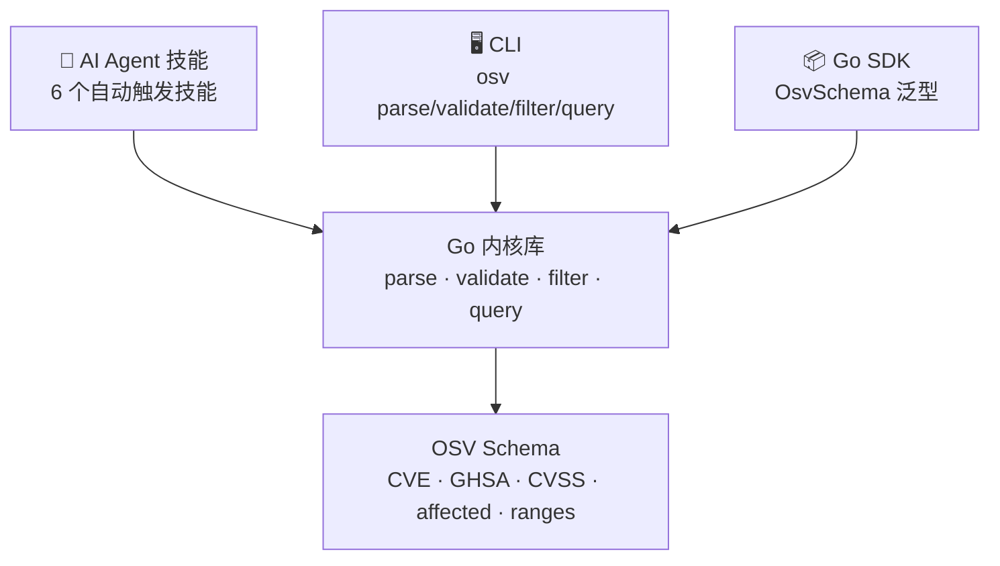
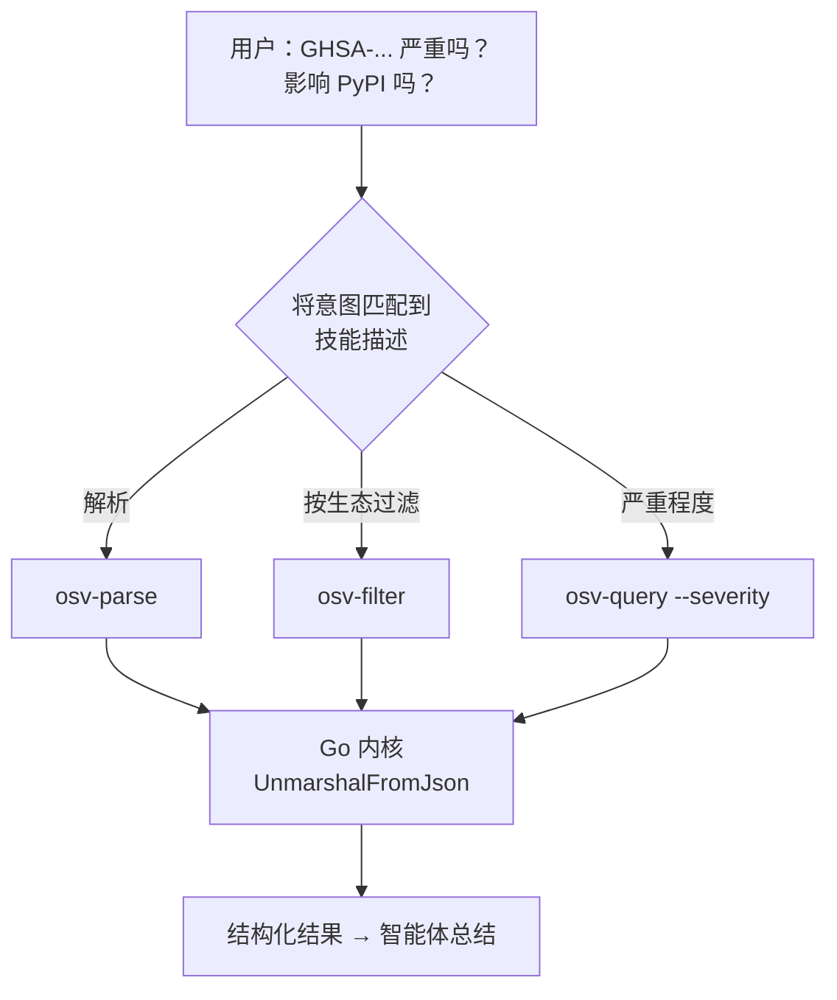
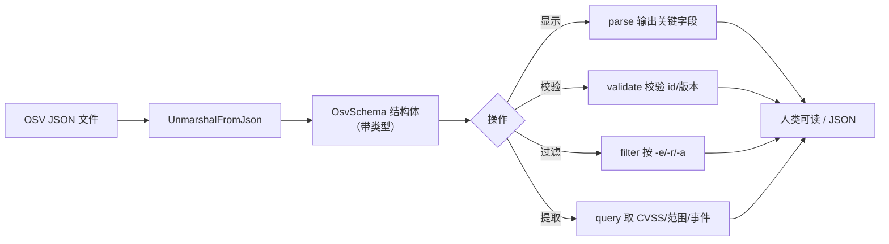
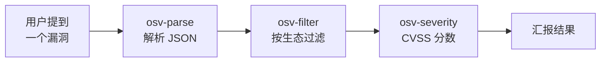

### 🤖 一段提示词，让你的 AI 智能体上岗

最快路径：**复制下方提示词，粘贴进 Claude Code 或 Codex，回车。** 智能体会安装 CLI、发现技能，随即开始处理 OSV 漏洞数据。完整版见 [AI Agent 接入](/zh/guide/ai-agent) 页。

```text
You now have access to the OSV Schema Skills toolkit
(https://github.com/scagogogo/osv-schema-skills), an AI-native Go library + CLI + Claude Code
Skills bundle for the OSV vulnerability schema. Set it up now:
1. Install the `osv` CLI — download a pre-built binary from the GitHub Release matching my
   OS/arch, or `go install github.com/scagogogo/osv-schema-skills/cmd/osv@latest`. Verify `osv version`.
2. Commands: `osv parse [-v] <file>`, `osv validate <file>…`, `osv filter -e/-r/-a <file>`,
   `osv query --severity cvss3|cvss2 --maven --ranges --events <file>`. Use `-o json` for parsing.
3. Clone the repo to activate the 6 Claude Code Skills (osv-parse/validate/filter/query/severity/affected).
When I ask about a vulnerability, pick the right command automatically, filter by ecosystem if I
name one, extract CVSS + affected ranges, and report concisely. Don't ask me which command to run.
```

→ [获取完整可复制提示词 →](/zh/guide/ai-agent)

---

### 它解决了什么问题

无论对人还是对 AI，处理漏洞数据都很痛苦：

- **OSV JSON 嵌套极深**——受影响包、CVSS 分数、版本范围、引用、事件时间线。手动看一条记录得翻 500 行。
- **过滤每次都要写一次性脚本**——"只看 PyPI 的包"或"只看 FIX 引用"，每次都变成一个临时脚本。
- **按 schema 校验**没有工具很容易出错（缺 `id`、范围格式错、severity 类型错）。
- **AI 智能体过去没有结构化入口**——在这个项目之前，智能体只能 `cat` JSON 然后一路瞎编。

### 解决方案：一个内核，三层访问

同一套解析/过滤/查询逻辑，可从任何地方触达：



| 层 | 最适合 | 示例 |
|----|--------|------|
| 🤖 **技能** | Claude Code、AI 工作流 | 你一提漏洞文件，智能体自动触发 `osv-parse` |
| 🖥️ **CLI** | Shell、CI 流水线 | `osv filter -e PyPI -o json vuln.json` |
| 📦 **SDK** | Go 应用 | `v.Affected.FilterByEcosystem(osv.EcosystemPyPI)` |

### 工作原理——意图到技能的路由

关键在于 **intent-to-skill routing（意图→技能路由）**：每个 `SKILL.md` 声明 *何时* 触发（`description`）以及 *能调用什么工具*（`allowed-tools: Bash(osv:*)`）。智能体把你的请求与这些描述匹配，挑出正确的 `osv` 子命令——你永远不必点名要跑哪个。



底层上，每条命令都调用同一个带类型的 Go 内核（`OsvSchema[EcosystemSpecific, DatabaseSpecific any]`）——所以 CLI、SDK、技能三者绝不可能彼此不一致。技能只是薄薄的 **声明式契约**；所有真实逻辑都集中在一处。

### 数据如何流转：从 JSON 到报告



### 一个典型的 AI 智能体工作流



---

准备好接入你的智能体了吗？**[复制提示词 →](/zh/guide/ai-agent)**
