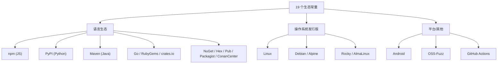
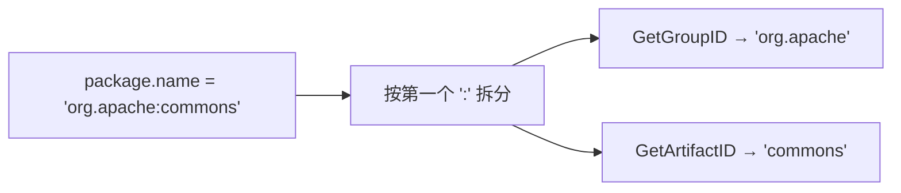

# 生态系统

SDK 把全部 19 个 OSV 生态定义为类型化常量——杜绝字符串拼错的隐患。

## 全部列表

| 常量 | 值 | 说明 |
|------|----|------|
| `EcosystemGo` | `Go` | Go 模块路径 |
| `EcosystemNpm` | `npm` | NPM 包名 |
| `EcosystemPyPI` | `PyPI` | 规范化的 PyPI 名 |
| `EcosystemRubyGems` | `RubyGems` | Gem 名 |
| `EcosystemCratesIo` | `crates.io` | Rust crate |
| `EcosystemPackagist` | `Packagist` | PHP |
| `EcosystemMaven` | `Maven` | Java——name 为 `groupId:artifactId` |
| `EcosystemNuGet` | `NuGet` | .NET |
| `EcosystemHex` | `Hex` | Erlang/Elixir |
| `EcosystemPub` | `Pub` | Dart |
| `EcosystemLinux` | `Linux` | 仅内核 |
| `EcosystemDebian` | `Debian` | 可能带 `:<RELEASE>` 后缀 |
| `EcosystemAlpine` | `Alpine` | 需带 `:v<RELEASE>` 后缀 |
| `EcosystemRocky` | `Rocky` | 可能带 `:<RELEASE>` 后缀 |
| `EcosystemAlmaLinux` | `AlmaLinux` | 可能带 `:<RELEASE>` 后缀 |
| `EcosystemAndroid` | `Android` | 组件名 |
| `EcosystemOSSFuzz` | `OSS-Fuzz` | Fuzz 目标 |
| `EcosystemConanCenter` | `ConanCenter` | C/C++ |
| `EcosystemGitHubActions` | `GitHub Actions` | `{owner}/{repo}` |

## 按类别分组



## 用法

```go
// 检查单个生态
if v.Affected.HasEcosystem(osv.EcosystemPyPI) {
    // ...
}

// 过滤受影响条目
pypiAffected := v.Affected.FilterByEcosystem(osv.EcosystemPyPI)

// Maven 拆分
for _, a := range v.Affected {
    if a.Package != nil && a.Package.IsMaven() {
        fmt.Println(a.Package.GetGroupID())    // groupId
        fmt.Println(a.Package.GetArtifactID()) // artifactId
    }
}
```

## Maven name 的拆分



源码：[`package.go`](https://github.com/scagogogo/osv-schema-skills/blob/main/package.go)
