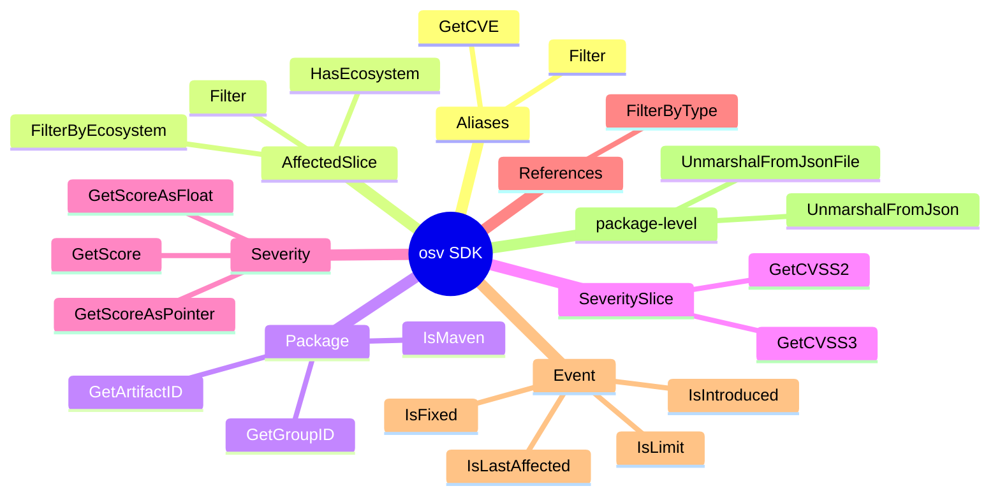
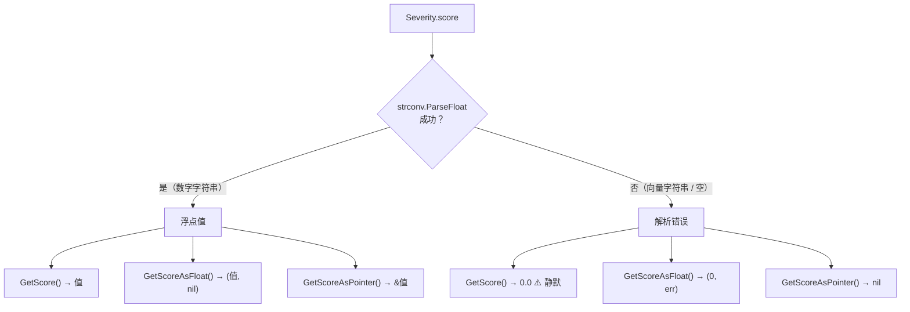
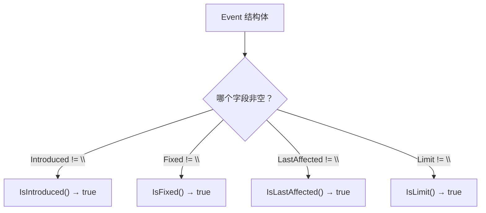
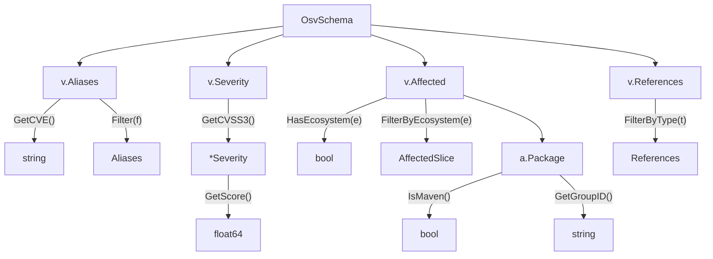
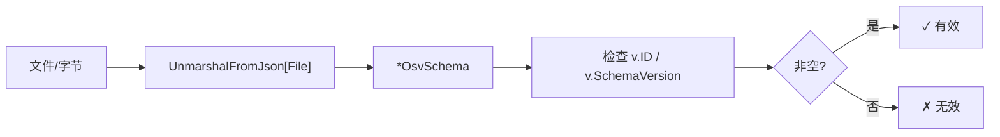
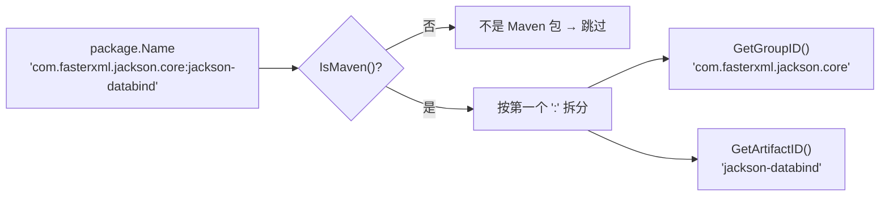
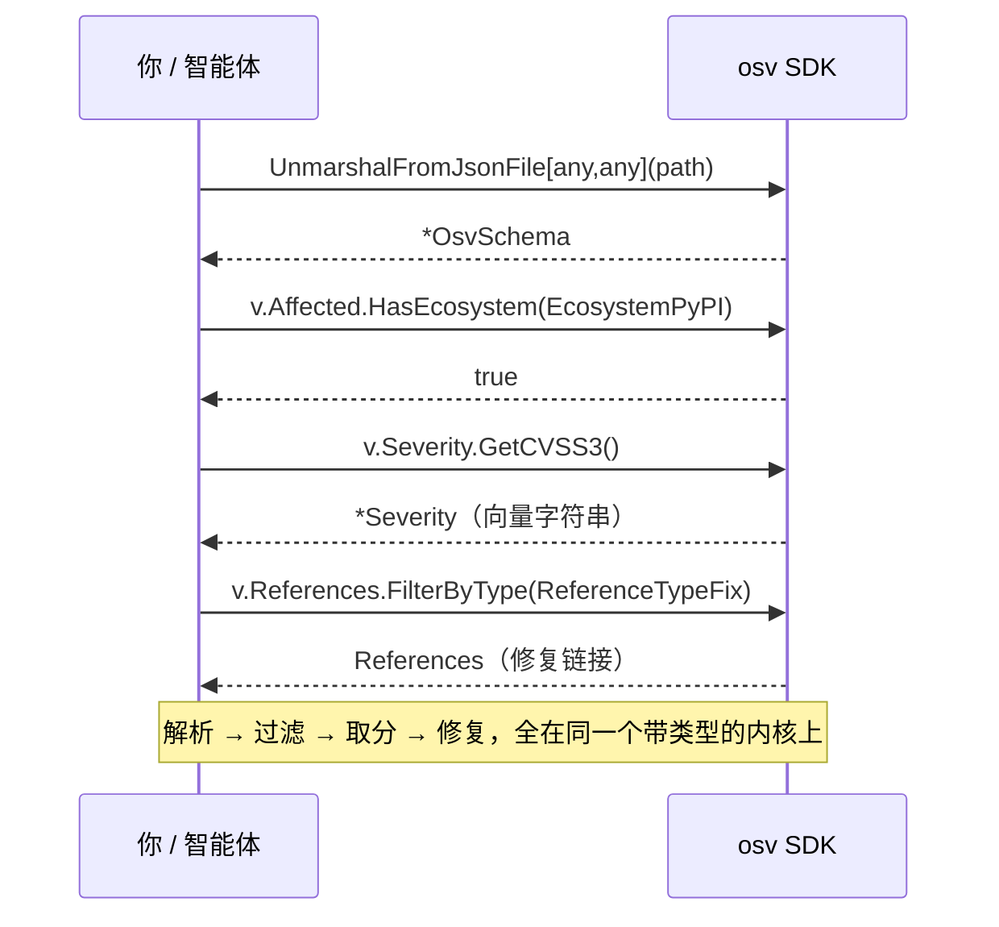
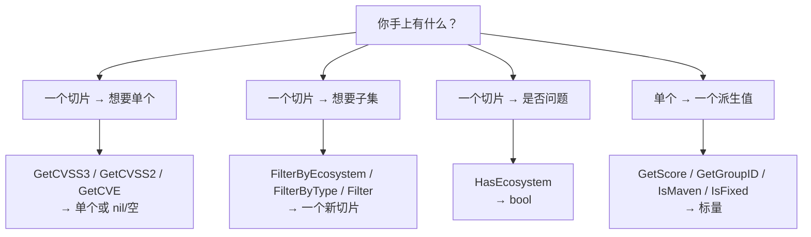

# 方法清单

SDK 最常用方法的速查表。全部已对照源码核实。

## 方法一览

按接收者类型分组——这就是你日常会用到的全部表面。



## Aliases

| 方法 | 签名 | 说明 |
|------|------|------|
| `GetCVE` | `() string` | 第一个匹配 `CVE-` 的别名（大小写不敏感——匹配前先转大写，故 `cve-2024-1` 能被找到并返回为 `CVE-2024-1`） |
| `Filter` | `(func(string) bool) Aliases` | 按谓词过滤别名 |

## AffectedSlice

| 方法 | 签名 | 说明 |
|------|------|------|
| `HasEcosystem` | `(Ecosystem) bool` | 是否有受影响条目匹配该生态 |
| `FilterByEcosystem` | `(Ecosystem) AffectedSlice` | 收窄到一个生态 |
| `Filter` | `(func(*Affected) bool) AffectedSlice` | 自定义谓词过滤 |

## Package

| 方法 | 签名 | 说明 |
|------|------|------|
| `IsMaven` | `() bool` | `Ecosystem == Maven` |
| `GetGroupID` | `() string` | Maven `groupId`（`:` 左侧） |
| `GetArtifactID` | `() string` | Maven `artifactId`（`:` 右侧） |

## SeveritySlice

| 方法 | 签名 | 说明 |
|------|------|------|
| `GetCVSS3` | `() *Severity` | 第一个 `Type == "CVSS_V3"` 的条目，或 `nil` |
| `GetCVSS2` | `() *Severity` | 第一个 `Type == "CVSS_V2"` 的条目，或 `nil` |

注意 `Severity` 上两个不同的字符串字段：`Type`（取值 `"CVSS_V2"` / `"CVSS_V3"` 之一，即 OSV `severity[].type` 判别字段）和 `Score`（*内容*——CVSS 向量字符串如 `CVSS:3.1/AV:N/…`，或裸数字如 `7.5`）。`GetCVSS3` 按 `Type` 匹配，绝不按向量前缀匹配。

## Severity

| 方法 | 签名 | 说明 |
|------|------|------|
| `GetScore` | `() float64` | 把 CVSS 分数解析为 `float64` |
| `GetScoreAsFloat` | `() (float64, error)` | 解析分数，向量字符串畸形时返回 error |
| `GetScoreAsPointer` | `() *float64` | 分数指针（用于可空字段） |

三者共用同一个解析器（`GetScoreAsFloat`），另外两个的差别只在**如何报告解析失败**——而 `score` 字段里若是 CVSS *向量字符串*（如 `CVSS:3.1/AV:N/…`）而非数字，那*就是*一次解析失败。按你能处理的失败形态来选变体：



::: warning `GetScore()` 会掩盖向量字符串情形
因为 `GetScore()` 丢弃了 error，向量字符串分数与真实的 `0.0` 无法区分。当这个区分重要时，改用 `GetScoreAsFloat()`（检查 `err`）或 `GetScoreAsPointer()`（检查 `nil`）——并直接从 `Severity.Score` 读取 CVSS 向量。
:::

## References

| 方法 | 签名 | 说明 |
|------|------|------|
| `FilterByType` | `(...ReferenceType) References` | 保留 `Type` 匹配给定类型**任一**的引用（OR 语义）；不传类型时返回 `nil` |

## Event

| 方法 | 签名 | 说明 |
|------|------|------|
| `IsIntroduced` | `() bool` | 事件标记 introduced 版本 |
| `IsFixed` | `() bool` | 事件标记 fixed 版本 |
| `IsLastAffected` | `() bool` | 事件标记 last_affected 版本 |
| `IsLimit` | `() bool` | 事件标记 range limit |

`Event` 结构体带四个可选字符串字段（`Introduced`、`Fixed`、`LastAffected`、`Limit`）；每个事件里**只有一个**被填充。每个 `Is*` 谓词只检查自己的字段是否非空——所以四者互斥，且恰好有一个返回 `true`：



::: tip 按顺序遍历事件，而非孤立看单个
单个事件只告诉你它是*哪种*边界；受影响/不受影响的答案来自按顺序走时间线、在每对 `introduced`/`fixed` 处翻转标记。见 [OSV Schema → 事件时间线判定](/zh/reference/osv-schema#某个版本是否受影响-——-事件时间线判定)。
:::

## Parsing

| 函数 | 签名 | 说明 |
|------|------|------|
| `UnmarshalFromJson` | `([]byte) (*OsvSchema[Eco,DB], error)` | 从字节解析 |
| `UnmarshalFromJsonFile` | `(string) (*OsvSchema[Eco,DB], error)` | 从文件路径解析 |

```go
// 通用解析——两个泛型都用 any
v, err := osv.UnmarshalFromJsonFile[any, any]("vuln.json")

// 或附加生态/库专属数据
v, err := osv.UnmarshalFromJsonFile[MyEco, MyDB]("vuln.json")
```

## 方法调用关系图



## 解析与校验的数据流



## Maven 坐标拆解

`GetGroupID` / `GetArtifactID` 按第一个 `:` 拆分 Maven 包名。仅当 `IsMaven()` 为真时才有意义。



## 一次真实查询，逐个方法

"某条 `GHSA-…` 是不是一个高危的 PyPI 漏洞，修复在哪？"——下面就是智能体（或你的代码）会走的精确方法链。



## 哪个方法返回什么



## 序列化辅助

大多数类型实现了 `sql.Scanner` 和 `driver.Valuer`，因此在 GORM 下能干净地作为 JSON 列存储。复杂嵌套类型（`AffectedSlice`、`SeveritySlice`、`Package`、`Credits`）会自动 marshal/unmarshal 为 JSON。

源码：根包 [`*.go`](https://github.com/scagogogo/osv-schema-skills)
