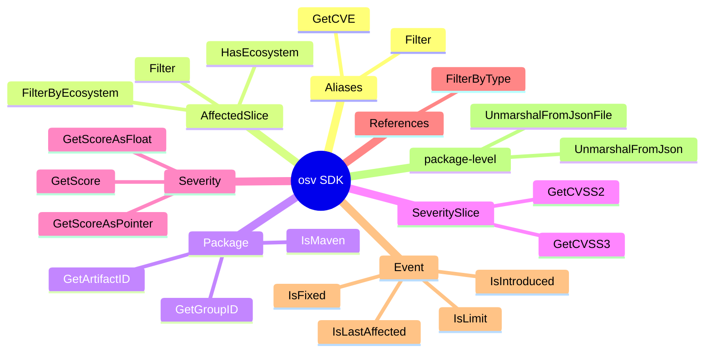
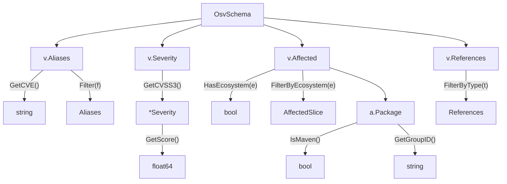
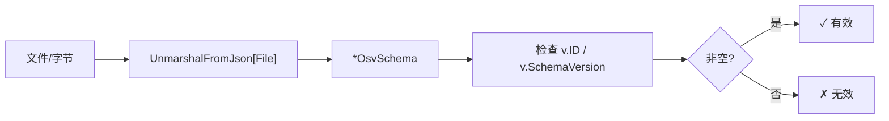
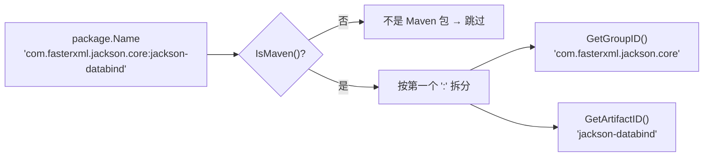
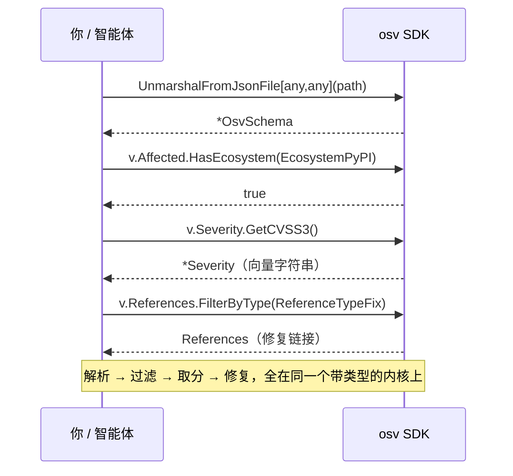
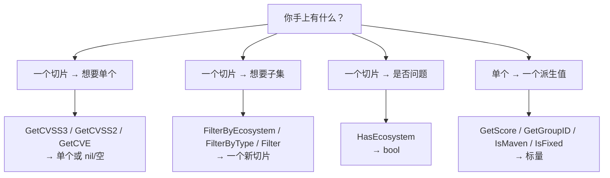

# 方法清单

SDK 最常用方法的速查表。全部已对照源码核实。

## 方法一览

按接收者类型分组——这就是你日常会用到的全部表面。



## Aliases

| 方法 | 签名 | 说明 |
|------|------|------|
| `GetCVE` | `() string` | 第一个以 `CVE-` 开头的标识 |
| `Filter` | `(func(string) bool) Aliases` | 按谓词过滤别名 |

## AffectedSlice

| 方法 | 签名 | 说明 |
|------|------|------|
| `HasEcosystem` | `(Ecosystem) bool` | 是否有受影响条目匹配该生态 |
| `FilterByEcosystem` | `(Ecosystem) AffectedSlice` | 收窄到一个生态 |
| `Filter` | `(func(*Affected) bool) AffectedSlice` | 自定义谓词过滤 |

## Package

| 方法 | 签名 | 说明 |
|------|------|------|
| `IsMaven` | `() bool` | `Ecosystem == Maven` |
| `GetGroupID` | `() string` | Maven `groupId`（`:` 左侧） |
| `GetArtifactID` | `() string` | Maven `artifactId`（`:` 右侧） |

## SeveritySlice

| 方法 | 签名 | 说明 |
|------|------|------|
| `GetCVSS3` | `() *Severity` | CVSS v3 条目，或 `nil` |
| `GetCVSS2` | `() *Severity` | CVSS v2 条目，或 `nil` |

## Severity

| 方法 | 签名 | 说明 |
|------|------|------|
| `GetScore` | `() float64` | 把 CVSS 分数解析为 `float64` |
| `GetScoreAsFloat` | `() (float64, error)` | 解析分数，向量字符串畸形时返回 error |
| `GetScoreAsPointer` | `() *float64` | 分数指针（用于可空字段） |

## References

| 方法 | 签名 | 说明 |
|------|------|------|
| `FilterByType` | `(...ReferenceType) References` | 按 `ADVISORY`、`FIX` 等过滤（可传多个） |

## Event

| 方法 | 签名 | 说明 |
|------|------|------|
| `IsIntroduced` | `() bool` | 事件标记 introduced 版本 |
| `IsFixed` | `() bool` | 事件标记 fixed 版本 |
| `IsLastAffected` | `() bool` | 事件标记 last_affected 版本 |
| `IsLimit` | `() bool` | 事件标记 range limit |

## Parsing

| 函数 | 签名 | 说明 |
|------|------|------|
| `UnmarshalFromJson` | `([]byte) (*OsvSchema[Eco,DB], error)` | 从字节解析 |
| `UnmarshalFromJsonFile` | `(string) (*OsvSchema[Eco,DB], error)` | 从文件路径解析 |

```go
// 通用解析——两个泛型都用 any
v, err := osv.UnmarshalFromJsonFile[any, any]("vuln.json")

// 或附加生态/库专属数据
v, err := osv.UnmarshalFromJsonFile[MyEco, MyDB]("vuln.json")
```

## 方法调用关系图



## 解析与校验的数据流



## Maven 坐标拆解

`GetGroupID` / `GetArtifactID` 按第一个 `:` 拆分 Maven 包名。仅当 `IsMaven()` 为真时才有意义。



## 一次真实查询，逐个方法

"某条 `GHSA-…` 是不是一个高危的 PyPI 漏洞，修复在哪？"——下面就是智能体（或你的代码）会走的精确方法链。



## 哪个方法返回什么



## 序列化辅助

大多数类型实现了 `sql.Scanner` 和 `driver.Valuer`，因此在 GORM 下能干净地作为 JSON 列存储。复杂嵌套类型（`AffectedSlice`、`SeveritySlice`、`Package`、`Credits`）会自动 marshal/unmarshal 为 JSON。

源码：根包 [`*.go`](https://github.com/scagogogo/osv-schema-skills)
