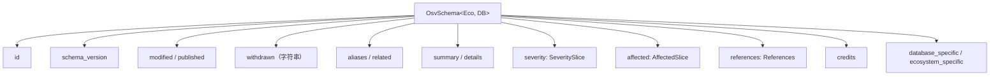
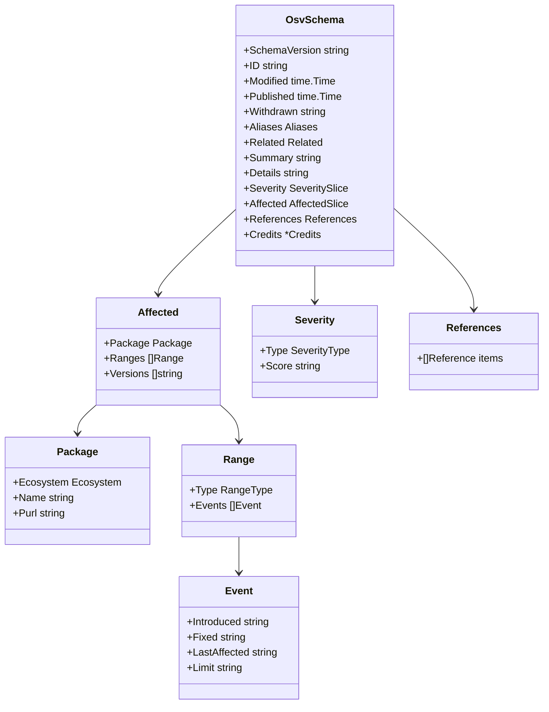
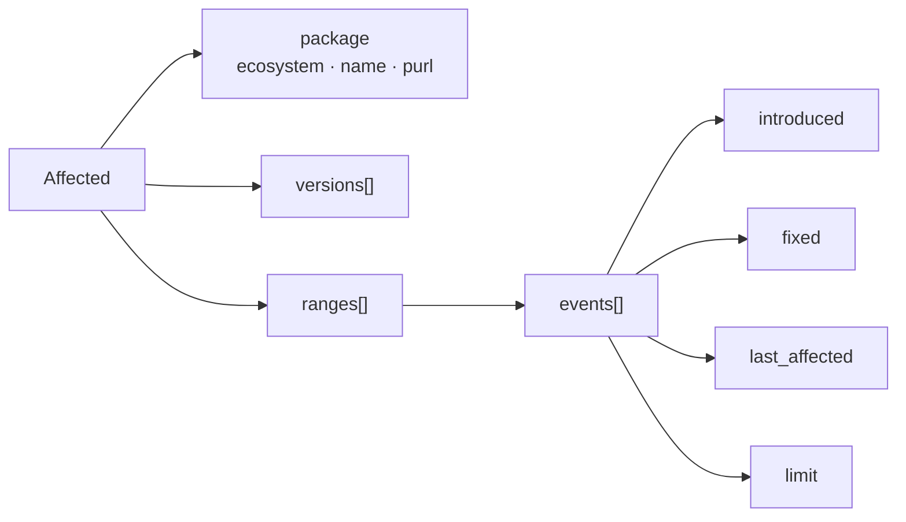
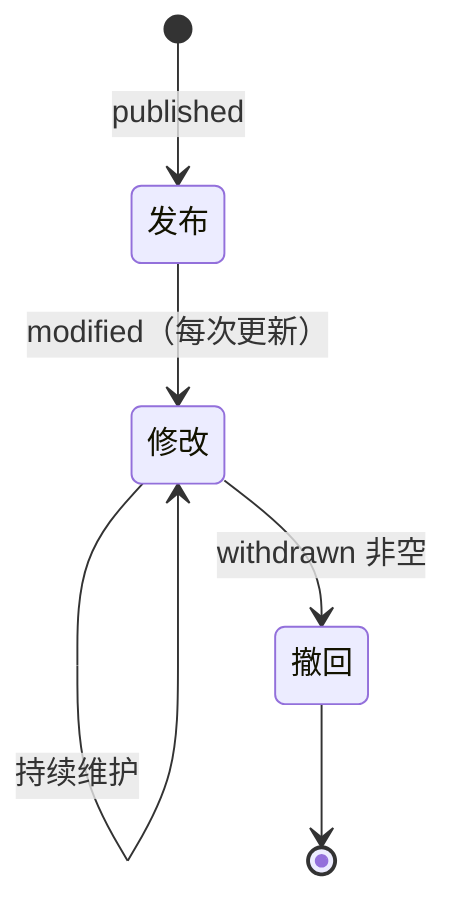
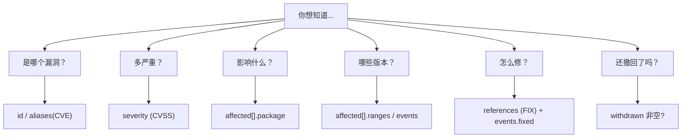

# OSV Schema

核心类型建模 [OSV Schema](https://ossf.github.io/osv-schema/)（当前 `1.4.0`）。

## 顶层结构

## 必需 vs 可选

| 字段 | 必需 | 说明 |
|------|------|------|
| `schema_version` | ✅ | 当前 `1.4.0` |
| `id` | ✅ | 唯一记录标识 |
| `modified` | ✅ | 最后修改时间 |
| `published` | ❌ | 首次发布时间 |
| `withdrawn` | ❌ | **字符串**，非 `time.Time` |
| `aliases` | ❌ | 如 CVE-2024-XXXX |
| `affected` | ❌ | 但通常存在 |
| `severity` | ❌ | CVSS v2 / v3 / v4 |

`osv validate` 强制 `id` 和 `schema_version`。

## 完整类型关系图

## Affected → package → ranges → events

## 一条记录的生命周期

## 字段速查（按用途）

## 源文件

所有类型在根包 `osv_schema` 中：

| 文件 | 内容 |
|------|------|
| `osv_schema.go` | `OsvSchema` 顶层类型 |
| `package.go` | `Package`、`Ecosystem` 常量 |
| `affected.go` | `Affected`、`AffectedSlice` |
| `severity.go` | `Severity`、`SeveritySlice` |
| `range.go` | `Range` |
| `event.go` | `Event` |
| `references.go` | `References` |
| `aliases.go` | `Aliases` |
| `related.go` | `Related` |
| `credits.go` | `Credits` |
| `unmarshal.go` | `UnmarshalFromJson` / `UnmarshalFromJsonFile` |
