# OSV Schema

核心类型建模 [OSV Schema](https://ossf.github.io/osv-schema/)（当前 `1.4.0`）。

## 顶层结构

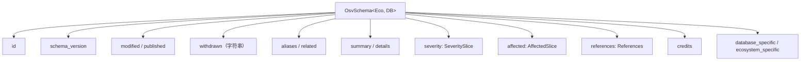

## 必需 vs 可选

| 字段 | 必需 | 说明 |
|------|------|------|
| `schema_version` | ✅ | 当前 `1.4.0` |
| `id` | ✅ | 唯一记录标识 |
| `modified` | ✅ | 最后修改时间 |
| `published` | ❌ | 首次发布时间 |
| `withdrawn` | ❌ | **字符串**，非 `time.Time` |
| `aliases` | ❌ | 如 CVE-2024-XXXX |
| `affected` | ❌ | 但通常存在 |
| `severity` | ❌ | CVSS v2 / v3 / v4 |

`osv validate` 强制 `id` 和 `schema_version`。

```mermaid
flowchart TD
  FILE["file.json"] --> READ{"os.ReadFile<br/>成功？"}
  READ -->|"否（缺失/权限）"| E1["错误：无法读取文件"]
  READ -->|是| JSON{"json.Valid？"}
  JSON -->|否| E2["错误：不是合法 JSON"]
  JSON -->|是| U["UnmarshalFromJson"]
  U --> ID{"id != \"\" ？"}
  ID -->|否| E3["错误：缺失 id"]
  ID -->|是| SV{"schema_version != \"\" ？"}
  SV -->|否| E4["错误：缺失 schema_version"]
  SV -->|是| OK["有效 ✓<br/>exit 0"]
  E1 --> FAIL["无效 ✗<br/>exit 1"]
  E2 --> FAIL
  E3 --> FAIL
  E4 --> FAIL
```

检查刻意做得浅——它确认记录*可解析*且带这两个身份字段，而非每个可选字段都合规。`affected`、`severity`、`references` 不检查；一条没有 affected 条目的记录照样通过校验。

## 完整类型关系图

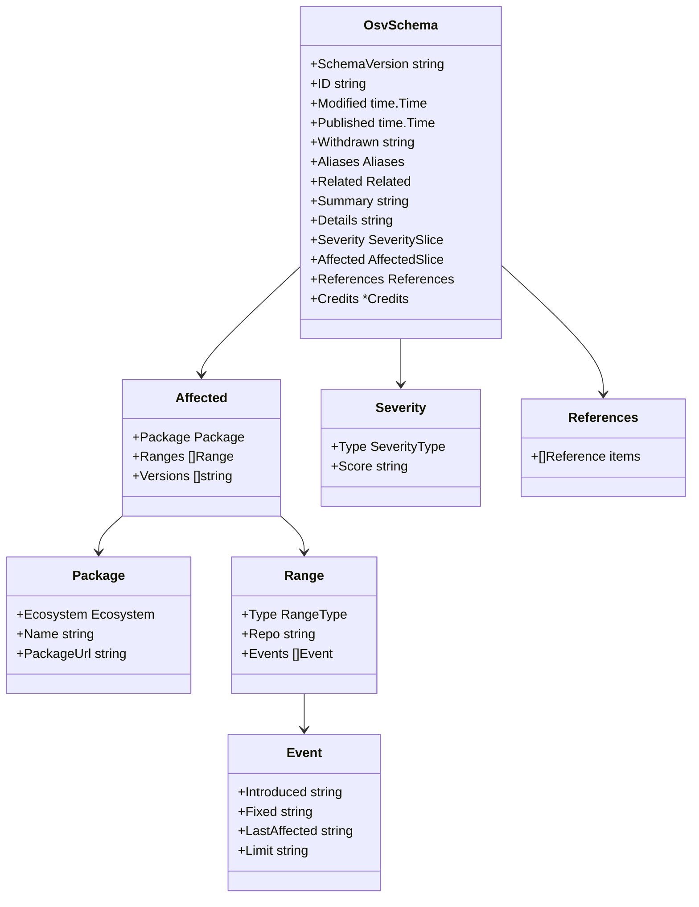

## Affected → package → ranges → events

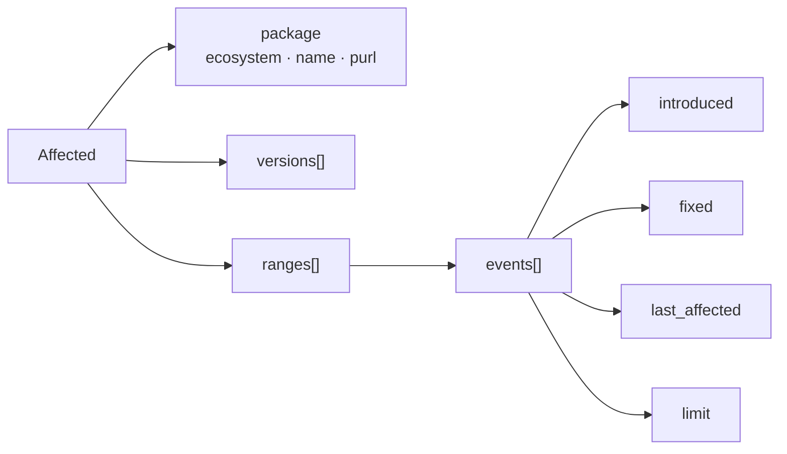

`package` 对象带三个字段：`ecosystem`（[类型化常量](/zh/reference/ecosystems)之一）、`name`（包名——对 Maven 是 `groupId:artifactId`）和 `purl`（可选的 [Package URL](https://github.com/package-url/purl-spec) 字符串）。`purl` 仅供参考；SDK 不解析它，故生态专属拆分（如 Maven GAV）应走 `name` 经 `GetGroupID` / `GetArtifactID`，而非 `purl`。

## 一条记录的生命周期

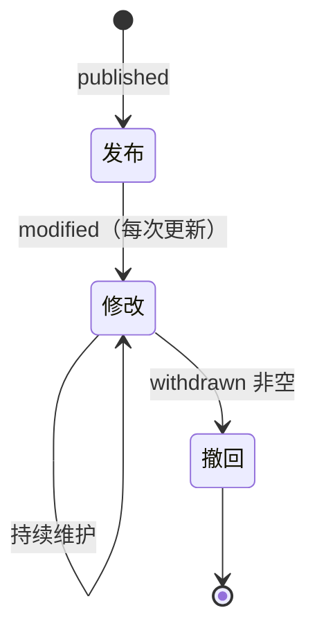

## 字段速查（按用途）

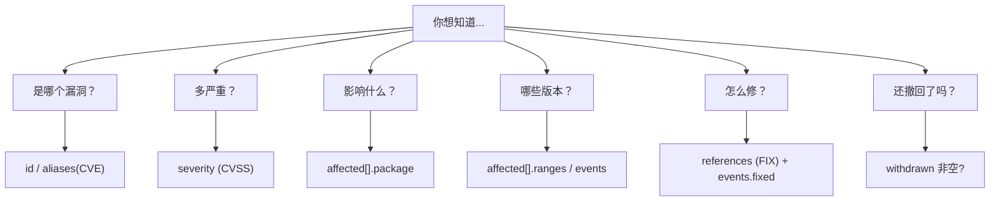

## 某个版本是否受影响？—— 事件时间线判定

消费 OSV 数据时最重要的一个算法就是：*给定一个具体版本，它脆弱吗？* OSV 不用散文回答，而是用每个 range 里那串有序的 `events`。你从左到右沿时间线走一遍，一路翻转一个"受影响"标志位。

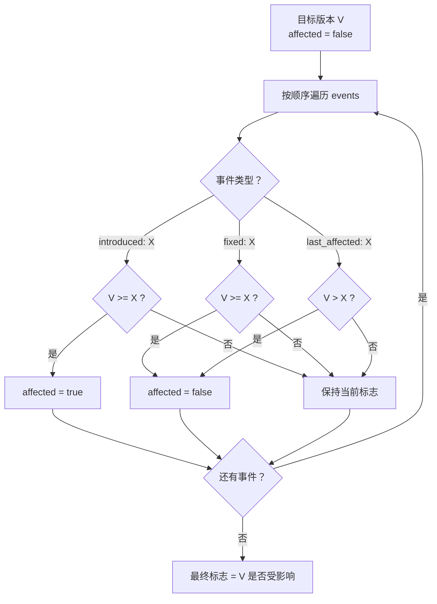

特殊值 `introduced: "0"` 表示"从最初的版本起"。上面的流程覆盖了三种常见事件（`introduced` / `fixed` / `last_affected`）；第四种 `limit` 标记范围上限，处理方式类似 `last_affected`——一旦 `V` 抵达 `limit`，标志即清零。它在 `GIT` 范围之外很少见。SDK 提供逐事件的谓词，方便你自己实现这套判定：

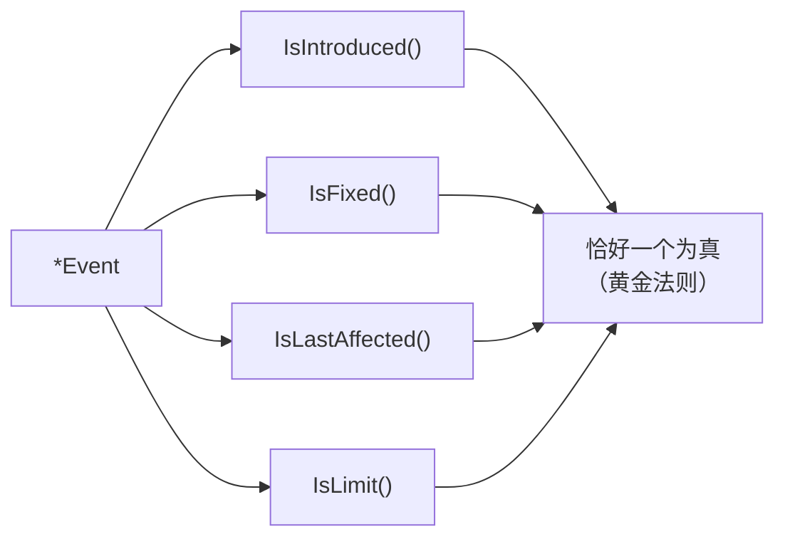

::: tip 黄金法则在这里为何关键
正因为每个事件恰好携带一个非空键，上面的遍历才能无歧义地对"哪个谓词为真"做 `switch`。这也是 `osv query --events` 输出 `omitempty` JSON 的原因——一个多余的 `"fixed": ""` 会让两个谓词看起来都为真。
:::

## RangeType —— 版本如何比较

上面算法里的 `<` / `>=` 比较**并非**通用的字符串比较。range 的 `type` 决定排序规则。

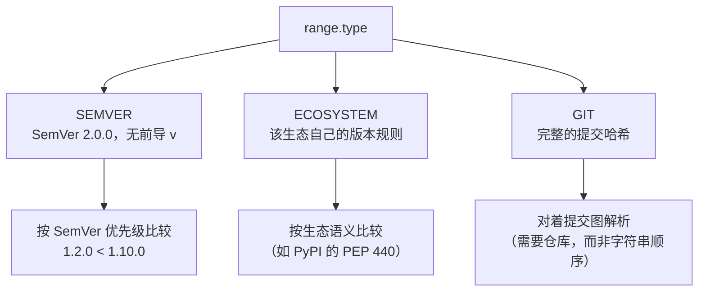

| `RangeType` | 常量 | 版本记号是…… |
|-------------|------|--------------|
| `SEMVER` | `RangeTypeSemver` | SemVer 2.0.0 字符串，按优先级比较 |
| `ECOSYSTEM` | `RangeTypeEcosystem` | 由生态排序的不透明字符串（PyPI→PEP 440 等） |
| `GIT` | `RangeTypeGit` | Git 提交哈希，需借助提交图解析 |

::: warning GIT 范围不可按字符串排序
对 `GIT` 范围，你不能靠比较哈希字符串来判断是否受影响——你需要仓库的提交祖先关系。把 `GIT` 范围当成"需要图解析"，而不是"像 SEMVER 那样比较"。
:::

## Severity 取分内部机制

`severity[].score` 存的是 **CVSS 向量字符串**，不是数字。SDK 暴露三个取分方法，共享同一个惰性解析、带 memoize 的底层值。

```mermaid
flowchart TD
  CALL["GetScore() / GetScoreAsFloat() / GetScoreAsPointer()"] --> CACHE{"有缓存的分数或 err？"}
  CACHE -->|命中| RET["返回缓存"]
  CACHE -->|未命中| EMPTY{"Score == \"\" ?"}
  EMPTY -->|是| ERR["err = 'score can not be empty'"]
  EMPTY -->|否| PARSE["strconv.ParseFloat(Score, 64)"]
  PARSE -->|成功| STORE["memoize 浮点数 → 返回"]
  PARSE -->|失败<br/>（向量字符串！）| ERR
  ERR --> OUT{"哪个取分方法？"}
  OUT -->|GetScore| Z["返回 0.0（错误被吞掉）"]
  OUT -->|GetScoreAsFloat| EF["返回 (0, error)"]
  OUT -->|GetScoreAsPointer| NP["返回 nil"]
```

| 取分方法 | 遇到向量字符串时 | 何时用 |
|----------|------------------|--------|
| `GetScore()` | `0.0` | 只想要个浮点数，且把 0 当作"不可用" |
| `GetScoreAsFloat()` | `(0, error)` | 必须区分真实的 0 与解析失败 |
| `GetScoreAsPointer()` | `nil` | 想用 `nil` 表示"没有数值分数" |

当分数是向量时要给严重程度排序，读 `SeveritySlice.GetCVSS3()` / `GetCVSS2()` 并解释向量——见 [Skills → severity](/zh/guide/skills/severity)。

## 序列化：一个结构体，六套标签命名空间

每个核心字段都同时为六个生态打了标签，因此同一个结构体无需适配器即可在 JSON、YAML、配置解码、原生 SQL、MongoDB 与 GORM 之间往返。

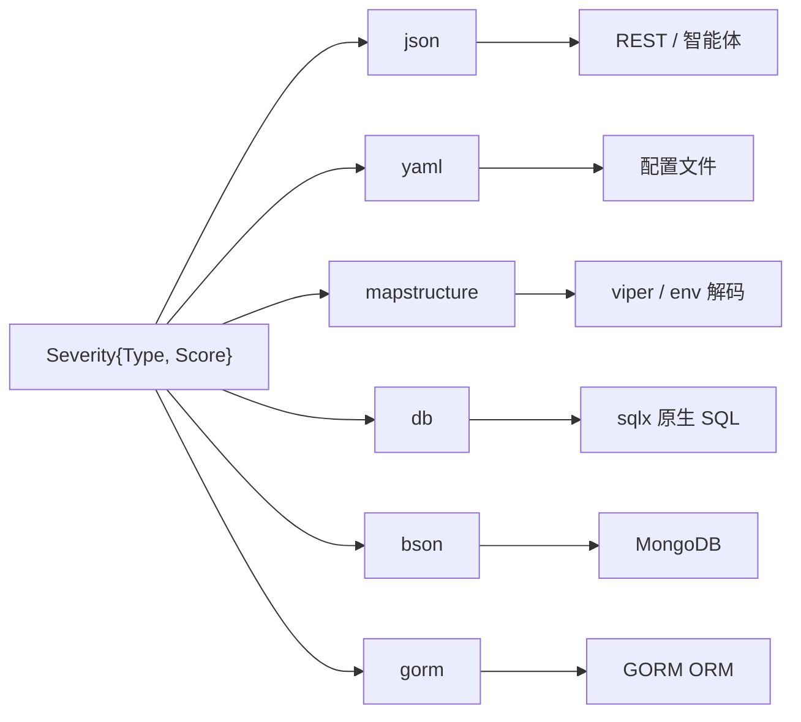

### 数据库策略：列 vs JSON 块

简单标量字段直接落成列。复杂的嵌套切片（`AffectedSlice`、`SeveritySlice`、`Range` 等）实现了 `sql.Scanner` + `driver.Valuer`，因此 GORM 把它们存成单个 JSON 字符串，读取时再复原。

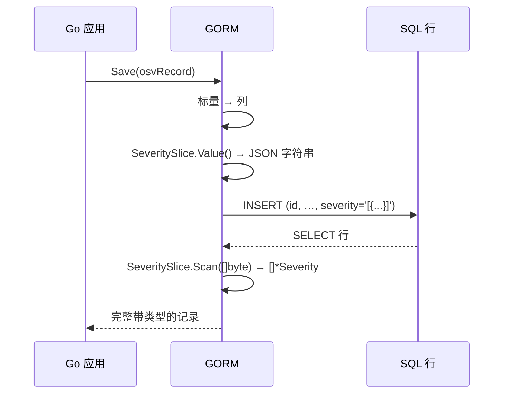

## 泛型类型参数

`OsvSchema[EcosystemSpecific, DatabaseSpecific]` 携带两个类型参数，向下流入 `Affected` 与 `Range`，让厂商专有的数据块保持带类型，而不是塌缩成 `map[string]any`。

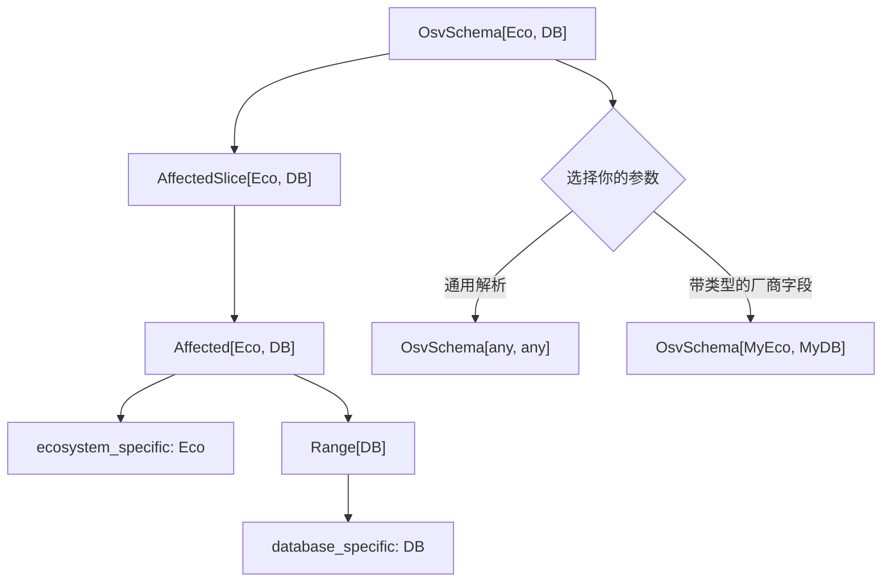

日常解析用 `[any, any]`（每条 CLI 命令都是如此）。仅当你需要对 `ecosystem_specific` / `database_specific` 做带类型访问时，才传入具体结构体。

## 源文件

所有类型在根包 `osv_schema` 中：

| 文件 | 内容 |
|------|------|
| `osv_schema.go` | `OsvSchema` 顶层类型 |
| `package.go` | `Package`、`Ecosystem` 常量 |
| `affected.go` | `Affected`、`AffectedSlice` |
| `severity.go` | `Severity`、`SeveritySlice` |
| `range.go` | `Range` |
| `event.go` | `Event` |
| `references.go` | `References` |
| `aliases.go` | `Aliases` |
| `related.go` | `Related` |
| `credits.go` | `Credits` |
| `unmarshal.go` | `UnmarshalFromJson` / `UnmarshalFromJsonFile` |
