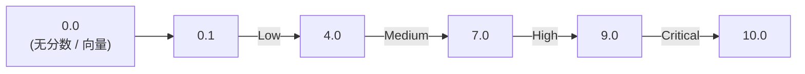

# CVSS 评分标准

**CVSS**（Common Vulnerability Scoring System，通用漏洞评分系统）是 OSV 用来编码漏洞严重程度的标准。本页解释 CVSS 如何工作、OSV 如何承载它、本工具箱如何解读它。

---

## CVSS 是什么？

CVSS 是由 [FIRST.org](https://www.first.org/cvss/) 维护的开放标准，基于一组结构化指标为漏洞赋予一个数字分数（0.0–10.0）。分数从一个**向量字符串**推导而来——这是指标的紧凑编码，不只是一个数字。

三个主要版本：

| 版本 | OSV `type` | 示例向量 |
|------|-----------|----------|
| CVSS v2 | `CVSS_V2` | `AV:N/AC:M/Au:N/C:P/I:P/A:P` |
| CVSS v3.1 | `CVSS_V3` | `CVSS:3.1/AV:N/AC:L/PR:N/UI:N/S:U/C:N/I:N/A:H` |
| CVSS v4.0 | （OSV 1.4.0 尚未支持） | `CVSS:4.0/AV:N/AC:L/AT:N/PR:N/UI:N/...` |

---

## 向量字符串

CVSS v3.1 向量编码 8 个基础指标，每个以 `键:值` 形式，用 `/` 分隔：

```
CVSS:3.1/AV:N/AC:L/PR:N/UI:N/S:U/C:N/I:N/A:H
       │   │   │   │   │   │   │   │
       │   │   │   │   │   │   │   └─ A:H  可用性影响：高
       │   │   │   │   │   │   └─ C:N    完整性影响：无
       │   │   │   │   │   └─ C:N      机密性影响：无
       │   │   │   │   └─ S:U        影响范围：不变
       │   │   │   └─ UI:N          用户交互：无
       │   │   └─ PR:N            所需权限：无
       │   └─ AC:L              攻击复杂度：低
       └─ AV:N                攻击向量：网络
```

向量告诉你分数*如何*推导——一眼可见这是网络可达、无需认证、影响可用性的漏洞。

---

## 分数等级

数字分数映射到定性等级：

| 分数 | 等级 | 含义 |
|------|------|------|
| 0.0 | None | 无影响（或向量不可解析） |
| 0.1–3.9 | Low | 影响极小 |
| 4.0–6.9 | Medium | 显著但有限 |
| 7.0–8.9 | High | 严重，易被利用 |
| 9.0–10.0 | Critical | 灾难性，需立即处理 |



---

## OSV 如何承载 CVSS

OSV 记录中，严重程度放在 `severity[]` 数组，每项有 `type` 和 `score`：

```json
{
  "severity": [
    {
      "type": "CVSS_V3",
      "score": "CVSS:3.1/AV:N/AC:L/PR:N/UI:N/S:U/C:N/I:N/A:H"
    }
  ]
}
```

**重要**：`score` 字段存的是**向量字符串**，不是数字。这是 OSV 规范的要求——向量比裸数字信息量更大，因为它展示了推理过程。

---

## 本工具箱如何解读

SDK 提供 `GetCVSS3()` 和 `GetCVSS2()` 抽取对应的严重程度条目：

```go
v, _ := osv_schema.UnmarshalFromJsonFile[any, any]("vuln.json")

if s := v.Severity.GetCVSS3(); s != nil {
    fmt.Println("向量:", s.Score)         // 向量字符串
    fmt.Println("数字:", s.GetScore())    // 0.0（见下！）
}
```

::: warning 向量 vs 数字的坑
`GetScore()` 对 `Score` 字段调用 `strconv.ParseFloat`。当 `Score` 是 CVSS 向量字符串（常见情况）时，`ParseFloat` 失败，`GetScore()` 返回 **`0.0`**——不是实际计算出的分数。

要从向量得到数字分数，必须用 CVSS 库（如 [go-cvss](https://github.com/goark/go-cvss)）解析向量。本工具箱有意不捆绑 CVSS 计算器——它给你原始向量，让你选择如何评分。
:::

### CLI 用法

```bash
# 抽取 CVSS v3 条目
osv query --severity cvss3 vuln.json

# 输出 JSON（含原始向量）
osv query --severity cvss3 -o json vuln.json
```

**示例 JSON 输出**：

```json
{
  "severity": {
    "type": "CVSS_V3",
    "score": "CVSS:3.1/AV:N/AC:L/PR:N/UI:N/S:U/C:N/I:N/A:H"
  }
}
```

这里的 `score` 是向量。`GetScore()` 会返回 `0.0`，因为字段不是纯数字。

---

## 为什么用向量而非数字？

裸分数（如 `7.5`）告诉你严重程度*是什么*，但不告诉你*为什么*。向量编码了推理：

- `AV:N`（网络可达）vs `AV:L`（本地访问）改变紧迫性
- `PR:N`（无需权限）vs `PR:H`（管理员）改变谁能利用
- `S:C`（范围改变）意味着漏洞跨越信任边界

两个数字分数相同的漏洞，运维含义可能截然不同。向量保留了这些信息。

---

## 跨数据库一致性

因为 OSV 标准化使用 CVSS 向量，你可以跨数据库比较严重程度：

- 同一漏洞的 GitHub 公告（`GHSA-...`）和 NVD 条目（`CVE-...`）会携带相同的 CVSS 向量
- 本工具箱的 `aliases[]` 链接让你能找到两条记录并验证它们的严重程度一致

---

## 另见

- [osv-severity 技能](/zh/guide/skills/severity) —— 技能级文档
- [方法清单 → severity](/zh/reference/methods#severity) —— SDK 方法签名
- [OSV Schema 标准](/zh/standards/osv-spec) —— 上层标准
- [FIRST CVSS 规范](https://www.first.org/cvss/) —— 权威 CVSS 标准