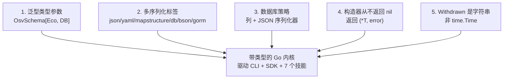

# 设计决策（RFC）

> 本页记录 OSV Schema Skills 核心类型**为何**长成现在这样。
> 这里的"RFC"指本项目的架构决策记录（ADR）——不是 RFC 3339（`Modified`/`Published`
> 字段所用的时间戳格式），也不是上游 OSV 规范那种 RFC 风格的提案。下文每条决策列出：
> 决策、理由、被否决的替代方案、以及落实该决策的精确源码位置。

## 范围

OSV schema 体量大、嵌套深。SDK 不为每个生态或数据库手写一次性结构体，而是预先做出
五条结构性决策。五条按优先级排序：



---

## 决策 1 — 泛型类型参数

**决策。** `OsvSchema[EcosystemSpecific, DatabaseSpecific any]` 带两个类型参数，每个生态/数据库都能附加类型化元数据，无需 fork 本库。

**理由。** OSV schema 允许每条 `affected` 携带 `ecosystem_specific`（该生态独有的自由字段）和 `database_specific`（发布该记录的数据库独有字段）。泛型内核把这些字段捕获为带类型的 Go 结构体，而非 `map[string]any`——由编译器（而非运行期断言）保证字段正确。不关心的调用方传 `any` 即可。

**被否决的替代方案。** 非泛型 `OsvSchema`，把 `EcosystemSpecific` 一律当作 `map[string]any`。否决原因：它丢掉了最常被查询字段的编译期类型（Maven 记录的 `group_id`/`artifact_id`、GitHub 记录的 `ghsa_id`），迫使每个调用方退回到无类型 map 访问。

**源码证据。** `osv_schema.go` — `type OsvSchema[EcosystemSpecific, DatabaseSpecific any] struct { ... }`。

**深入。** 见[自定义生态与数据库特定字段](/zh/advanced/custom-specifics)，含类图与带类型的 `Eco`/`DB` 结构体完整示例。

---

## 决策 2 — 每字段多序列化标签

**决策。** 每个核心字段带六个标签：`json`、`yaml`、`mapstructure`、`db`、`bson`、`gorm`。

**理由。** 同一个 `OsvSchema` 结构体要在五个互不相关的生态间往返：JSON（OSV 线上格式）、YAML（人写配置）、mapstructure（配置加载）、BSON（MongoDB）、GORM（SQL）。给一个结构体打全五种标签，意味着唯一的真相源——结构体本身——在每个访问层（CLI、SDK、技能）都保持有效。加一个字段一次，五条序列化路径同步更新；没有第二个会忘记的地方。

**被否决的替代方案。** 每种序列化目标各写一个 DTO（`JsonOsv`、`BsonOsv`……）。否决原因：漏洞数据实践中会在五种格式间流转（读 JSON → 经 GORM 存进 Postgres → 导出 BSON），维护 N 个结构体同步会成倍放大漂移风险——而这正是标签要消除的那类 bug。

**源码证据。** `OsvSchema` 与 `Package` 的每个字段都带全套标签。例如 `Withdrawn` 字段（见决策 5）和 `Package.Name` 都带齐六个标签。见 `osv_schema.go` 与 `package.go`。

**深入。** 见 [GORM 与 BSON 序列化](/zh/advanced/serialization)，含完整标签表与各目标用法。

---

## 决策 3 — 数据库策略：标量入列，嵌套用 JSON 序列化器

**决策。** 简单标量字段（`id`、`summary`、`withdrawn`……）存为**列**；复杂嵌套结构（`AffectedSlice`、`SeveritySlice`、`Aliases`、`Related`）经 GORM `serializer:json` 存为 **JSON 字符串**。

**理由。** 标量正是 SQL 索引与 `WHERE` 子句想要的——`id` 上一列就能直接 `WHERE id = ?` 查询，还能建索引。OSV 嵌套结构任意深（一条 `affected` 含 ranges、events、生态特定字段），映射到关系列会很别扭，且需大量联表。把它们存成 JSON 列，保证每个漏洞一行、标量键可查，嵌套载荷原样保留，供 SDK 反序列化回带类型结构体——无数据丢失，也不随 OSV spec 改动改库表结构。

**被否决的替代方案。** 完全关系式规范化（每个嵌套实体一张表，ranges/events 再用联表）。否决原因：OSV schema 在演进，嵌套形状是开放的（`ecosystem_specific` 自由字段）；规范化会把库表结构耦合到每次上游 spec 修订，每次改动都要迁移。

**源码证据。** `osv_schema.go` 中，标量字段用纯 `gorm:"column:<name>"`（如 `SchemaVersion`、`Id`、`Summary`），嵌套切片用 `gorm:"column:<name>;serializer:json"`（如 `Aliases`、`Related`、`Affected`）。

**深入。** 见 [GORM 与 BSON 序列化](/zh/advanced/serialization)，含 GORM 映射与端到端存取示例。

---

## 决策 4 — 构造器从不返回 nil；错误显式返回

**决策。** `NewVersion` 风格的反序列化函数返回 `(*OsvSchema[Eco, DB], error)`——绝不返回一个藏着部分/非法值的非 nil 指针。任何失败都返回 `nil, err`。

**理由。** 那种在输入非法时静默返回零值结构体的"构造器"是典型的 Go 坑：调用方拿到非 nil 指针，解引用后对空数据操作，却不知解析已失败。通过显式返回 `error` 并在失败时返回 `nil`，类型系统迫使每个调用方做决定——处理错误，或向上传播。不存在"看着没事、其实是空的"中间态。

**被否决的替代方案。** 只提供 `MustUnmarshal` API，遇坏 JSON 直接 panic。否决原因：漏洞数据是不可信外部输入（来自多个数据库的公告）；对 CLI 工具与长驻服务而言，遇非法输入 panic 不合适。

**源码证据。** `unmarshal.go`：

```go
func UnmarshalFromJson[EcosystemSpecific, DatabaseSpecific any](
    jsonBytes []byte,
) (*OsvSchema[EcosystemSpecific, DatabaseSpecific], error) {
    r := &OsvSchema[EcosystemSpecific, DatabaseSpecific]{}
    err := json.Unmarshal(jsonBytes, &r)
    if err != nil {
        return nil, err   // nil 指针 + 显式 error —— 绝不返回部分值
    }
    return r, nil
}
```

`UnmarshalFromJsonFile` 遵循同一契约。

---

## 决策 5 — `Withdrawn` 是字符串，而非 `time.Time`

**决策。** `Withdrawn` 字段类型为 `string`，不是 `time.Time`。字符串非空即代表已撤回。

**理由。** OSV spec 在记录撤回时把 `withdrawn` 格式化为 RFC 3339 时间戳，但该字段可选——多数记录永不撤回。若字段是 `time.Time`，Go 的零值（`0001-01-01T00:00:00Z`）是个合法 `time.Time`，作为"已撤回"标记却毫无意义，迫使每个消费方都得记住"`time.Time` 零值不等于未撤回"这条规则。用 `string` 让"缺失"无歧义：空串 = 未撤回，非空串 = 已撤回（且串即时间戳）。代价是想要 `time.Time` 的消费方得自己解析——但只有真正需要时才解析，而这很少见。

**被否决的替代方案。** `*time.Time`（可 nil 指针）以区分"缺失"与"存在"。否决原因：它让每次结构体拷贝与比较都背上 nil 检查，且同样的六标签序列化契约（决策 2）还得在 json/yaml/bson/gorm 各处给指针开特例。字符串在任何地方都以相同方式序列化，零特例。

**源码证据。** `osv_schema.go`：

```go
// TODO 2023-5-23 19:10:45 草这个字段啥意思...
Withdrawn string `mapstructure:"withdrawn" json:"withdrawn" yaml:"withdrawn" db:"withdrawn" bson:"withdrawn" gorm:"column:withdrawn"`
```

注意同结构体上兄弟字段的对照：`Modified` 与 `Published` *是* `time.Time`（已发布记录里它们总是存在），而 `Withdrawn` 恰恰因为是可选字段才用 `string`。

---

## 小结

| # | 决策 | 一句话理由 | 源码 |
|---|------|-----------|------|
| 1 | 泛型 `[Eco, DB]` | 编译期类型化生态/数据库特定字段 | `osv_schema.go` |
| 2 | 每字段六标签 | 一个结构体、五种序列化器、无漂移 | 全部核心 `.go` |
| 3 | 标量入列、嵌套入 JSON | 可索引键 + 完整嵌套载荷 | `osv_schema.go` |
| 4 | `(*T, error)`、失败不返回 nil | 强制显式错误处理 | `unmarshal.go` |
| 5 | `Withdrawn string` | 可选字段"缺失"无歧义 | `osv_schema.go` |

这五条决策解释了为何同一个带类型内核能同时驱动 CLI、Go SDK 与七个 Claude Code 技能，而三层绝不漂移。
