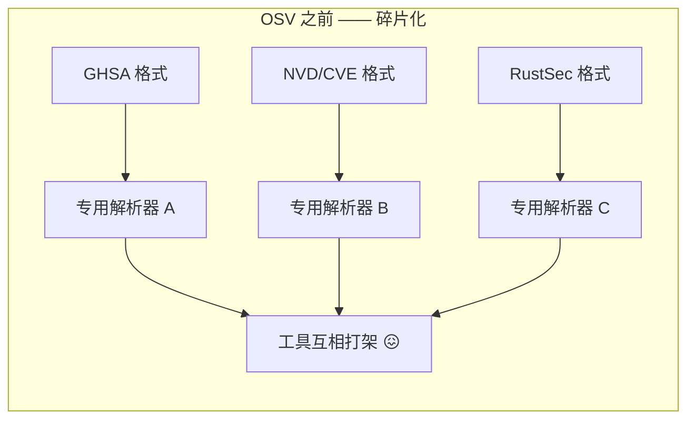
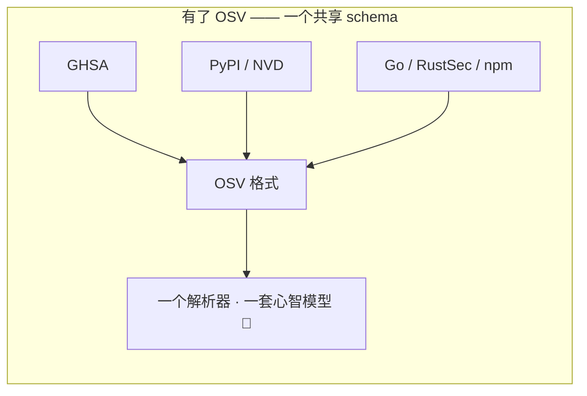
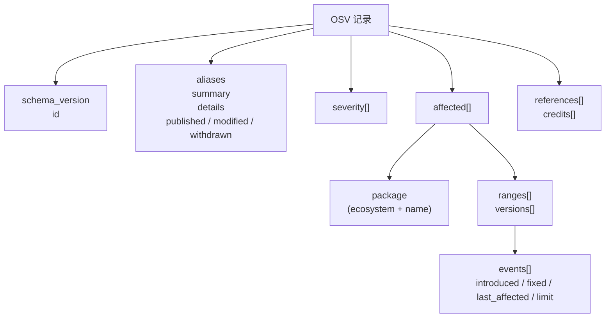

# OSV Schema 标准

**OSV**（Open Source Vulnerability，开源漏洞）是一个用于描述开源包漏洞的开放 schema。本页解释标准本身——其起源、治理、设计原则，以及本工具箱如何实现它。

---

## OSV 是什么？

OSV 是一个基于 JSON 的 schema，由 [开源安全基金会（OpenSSF）](https://openssf.org/)（Linux Foundation 项目）维护。它为漏洞记录定义了**统一的、共享的形状**，使得：

- 数据库（GitHub、PyPI、Go、RustSec、npm……）能用一种通用格式发布公告
- 工具能消费任意来源的公告，无需写专用解析器
- 自动化（CI、扫描器、AI Agent）能统一地推理漏洞

权威规范位于 [ossf.github.io/osv-schema](https://ossf.github.io/osv-schema/)。

---

## OSV 为何存在

OSV 出现之前，每个漏洞数据库都说自己的方言：



能读懂 GitHub 公告的工具读不了 NVD 条目。版本范围是散文（"2.4.1 之前"），机器无法可靠比较。包身份含混——`requests` 可能是 PyPI 包、RubyGem 或 npm 模块。

OSV 三个一并解决：



---

## Schema 的设计原则

OSV schema 建立在三个核心思想上：

### 1. 生态限定的包身份

一个包永远不只是 `requests`。它是 *PyPI 生态里的* `requests`。`ecosystem` + `name` 组合在全球唯一无歧义：

```json
{
  "package": { "ecosystem": "PyPI", "name": "requests" }
}
```

这就是 `osv filter -e PyPI` 能工作的原因——生态是一等字段，不是猜测。

### 2. 版本范围即事件时间线

OSV 不写"影响 2.4.1 之前的版本"这样的散文，而是记录一串有序事件：

```json
{
  "ranges": [{
    "type": "ECOSYSTEM",
    "events": [
      { "introduced": "0" },
      { "fixed": "2.4.1" }
    ]
  }]
}
```

机器沿着时间线走，判断任意具体版本是否落在其中——无需解析英语。完整机制见 [版本范围语义](/zh/advanced/version-ranges)。

### 3. 机器可读的严重程度

严重程度以 CVSS 向量字符串（结构化公式）记录，而非自由文本标签：

```json
{
  "severity": [{
    "type": "CVSS_V3",
    "score": "CVSS:3.1/AV:N/AC:L/PR:N/UI:N/S:U/C:N/I:N/A:H"
  }]
}
```

这让工具能推导数字分数、比较严重程度、推理*为什么*一个漏洞被评为这个等级。见 [CVSS 评分标准](/zh/standards/cvss)。

---

## 记录形状

一条完整的 OSV 记录有这些顶层字段：



| 字段 | 用途 |
|------|------|
| `schema_version` | 该记录遵循的 OSV 规范版本（当前 `1.4.0`） |
| `id` | 全局唯一记录 ID（如 `GHSA-...`、`CVE-...`） |
| `aliases` | 同一漏洞的其他 ID（如 GHSA 记录别名指向一个 CVE） |
| `summary` / `details` | 人类可读描述 |
| `published` / `modified` / `withdrawn` | 生命周期时间戳（RFC 3339） |
| `severity` | CVSS v2 / v3 / v4 向量 |
| `affected` | 核心：哪些包、哪些版本 |
| `references` | 公告、修复、报告链接 |
| `credits` | 报告者或修复者 |

本工具箱的 `OsvSchema[Eco, DB]` 结构体逐字段镜像这个形状。完整清单见 [OSV Schema 参考](/zh/reference/osv-schema)。

---

## Schema 版本管理

OSV schema 本身有版本（semver）。本工具箱当前目标是 **1.4.0**，通过以下命令暴露：

```bash
osv version
# OSV schema version: 1.4.0
```

Schema 新增字段时，本工具箱在次要版本中采纳。已有字段不会以破坏旧记录的方式移除——这是 schema 的向后兼容承诺。

---

## 治理

- **维护方**：OpenSSF 漏洞披露工作组
- **流程**：开放的 GitHub 仓库（[github.com/OSSF/osv-schema](https://github.com/OSSF/osv-schema)），RFC 式提案
- **采纳者**：GitHub 公告数据库、PyPI 公告数据库、Go 漏洞库、RustSec、npm audit、PyTornado 等
- **聚合**：[osv.dev](https://osv.dev/) 将所有参与数据库聚合成一个可查询的 API

---

## 本工具箱如何实现该标准

| 标准要求 | 我们的实现 |
|---------|----------|
| 解析所有 OSV 字段 | `OsvSchema[Eco, DB]` 结构体，带完整 JSON 标签 |
| 校验必需字段 | `osv validate` 检查 `id` + `schema_version` |
| 按生态过滤 | `FilterByEcosystem()` + `osv filter -e` |
| 抽取严重程度 | `GetCVSS*()` + `osv query --severity` |
| 遍历事件时间线 | `Range.Events` + `osv query --events` |
| 跨数据库别名 | `aliases[]` + `osv filter -a` |
| 引用分类 | `references[].type` + `osv filter -r` |

每条 CLI 命令和 SDK 方法都映射到标准的特定部分——不多不少。

---

## 另见

- [OSV Schema 参考](/zh/reference/osv-schema) —— 完整字段清单
- [CVSS 评分标准](/zh/standards/cvss) —— 严重程度如何编码
- [版本范围语义](/zh/advanced/version-ranges) —— 范围如何工作
- [生态命名](/zh/standards/ecosystems) —— 生态注册表
- [官方 OSV 规范](https://ossf.github.io/osv-schema/) —— 权威来源