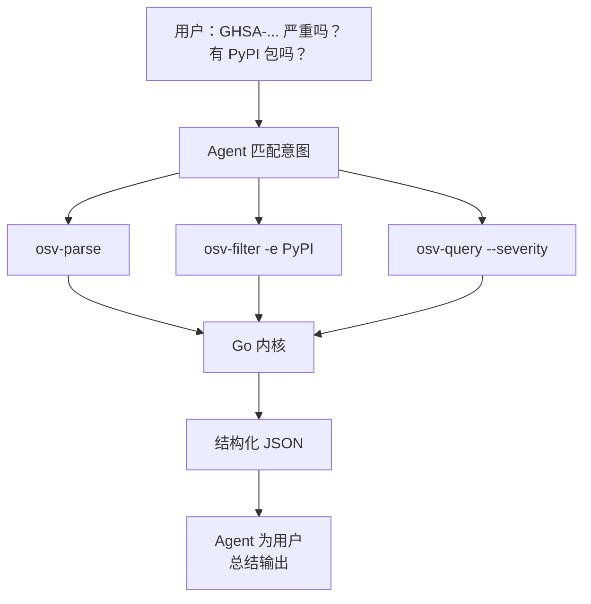

# AI Agent 自动化

让 AI Agent（Claude Code、Codex 等）自动处理漏洞数据——通过触发正确的技能自动执行。

---

## 模式



Agent 无需知道 `osv` 命令名字——它把你的自然语言请求与各技能的 description 匹配，挑出正确的子命令。

---

## 一段提示词接入 Agent

复制进 Claude Code 或 Codex：

```text
You now have access to the OSV Schema Skills toolkit
(https://github.com/scagogogo/osv-schema-skills), an AI-native Go library + CLI + Claude Code
Skills bundle for the OSV vulnerability schema. Set it up now:
1. Install the `osv` CLI — download a pre-built binary from the GitHub Release matching my
   OS/arch, or `go install github.com/scagogogo/osv-schema-skills/cmd/osv@latest`. Verify `osv version`.
2. Commands: `osv parse [-v] <file>`, `osv validate <file>…`, `osv filter -e/-r/-a <file>`,
   `osv query --severity cvss3|cvss2 --maven --ranges --events <file>`. Use `-o json` for parsing.
3. Clone the repo to activate the 7 Claude Code Skills (osv-parse/validate/filter/query/severity/affected/installation).
When I ask about a vulnerability, pick the right command automatically, filter by ecosystem if I
name one, extract CVSS + affected ranges, and report concisely. Don't ask me which command to run.
```

Agent 执行完这段设置后，会在你提到漏洞文件时自动调用正确的 `osv` 子命令。

---

## 示例交互

**用户**："`GHSA-vxv8-r8q2-63xw.json` 里是什么？"

**Agent（内部）**：匹配"描述漏洞文件" → `osv-parse`
```bash
osv parse test_data/GHSA-vxv8-r8q2-63xw.json
```

**Agent（回复）**："GHSA-vxv8-r8q2-63xw 是 Django admin 的目录遍历漏洞，影响 PyPI 包 `django`。在 2.2.24、3.1.4、3.2.1 中修复。"

---

**用户**："严重吗？"

**Agent（内部）**：匹配"严重程度" → `osv-query --severity`
```bash
osv query --severity cvss3 test_data/GHSA-vxv8-r8q2-63xw.json
```

**Agent（回复）**："这条 GHSA 记录没有 CVSS 分数。"

---

**用户**："有哪些 PyPI 包受影响？"

**Agent（内部）**：匹配"受影响 PyPI" → `osv-filter -e PyPI`
```bash
osv filter -e PyPI -o json test_data/GHSA-vxv8-r8q2-63xw.json
```

**Agent（回复）**："PyPI 上的 `django`，版本 2.2.24、3.1.4、3.2.1。"

---

## 技能自动触发

克隆仓库后，`.claude/skills/*/SKILL.md` 中的 7 个技能自动激活。每个技能的 `description` 字段声明**何时**触发：

- `osv-parse` → "你需要检视一个 OSV 漏洞 JSON 文件的内容"
- `osv-filter` → "你需要把漏洞记录收窄到特定生态、引用类型或别名模式"
- `osv-query` → "你需要从 OSV 记录抽取特定子信息：CVSS 严重程度、Maven GAV、版本范围、事件时间线"

Agent 把你的请求与这些描述匹配——你无需背子命令名字。

---

## 为什么这样可行

- **结构化输出**：`-o json` 给 Agent 干净可解析的数据——不会在原始文本上幻觉
- **唯一真相来源**：所有技能调用同一个 Go 内核，结果一致
- **无需自定义集成**：克隆仓库、粘贴一段提示词，Agent 即可上岗

---

## 另见

- [AI Agent 接入](/zh/guide/ai-agent) —— 完整设置指南与可复制提示词
- [Skills 总览](/zh/guide/skills) —— 每个技能做什么、何时触发
- [实战示例：AI 工作流](/zh/guide/examples#7-ai-agent-工作流意图到报告) —— 详细走查