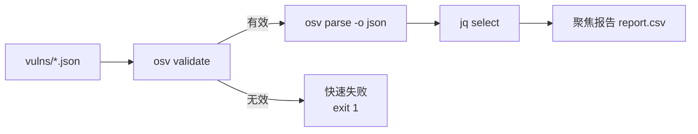

# 批量漏洞扫描

扫描一个目录的 OSV 记录，提取关心的字段，产出聚焦的报告。

---

## 流水线



---

## 第 1 步：全部校验

```bash
osv validate vulns/*.json
```

如有文件格式错误，先修复再继续。快速失败能避免在坏数据上跑完整个流水线。

---

## 第 2 步：提取关心的字段

对每条有效记录，抽取 ID、摘要、CVSS 分数、受影响生态：

```bash
for f in vulns/*.json; do
  osv parse -o json "$f" | jq -r '
    [
      .id,
      (.summary // "(无摘要)"),
      ((.severity[0].score // "") | tostring),
      ([.affected[].package.ecosystem] | unique | join(","))
    ] | @csv
  '
done > report.csv
```

**示例输出**（`report.csv`）：

```csv
"GHSA-vxv8-r8q2-63xw","Potential directory traversal in Django admin","","PyPI"
"CVE-2024-1234","RCE in log4j","CVSS:3.1/AV:N/AC:L/PR:N/UI:N/S:U/C:H/I:H/A:H","Maven"
```

::: warning 向量分数
当 `severity[].score` 是 CVSS 向量字符串（非数字）时，`GetScore()` 返回 `0.0`。上面的 CSV 保留原始向量——要得到数字分数，需用 CVSS 库解析向量。见 [方法清单 → severity](/zh/reference/methods#severity)。
:::

---

## 第 3 步：按生态过滤

只显示 PyPI 受影响的漏洞：

```bash
for f in vulns/*.json; do
  osv filter -e PyPI -o json "$f" | jq -r '.id'
done
```

或跨语料聚合生态计数：

```bash
for f in vulns/*.json; do
  osv parse -o json "$f" | jq -r '.affected[].package.ecosystem'
done | sort | uniq -c | sort -rn
```

**示例输出**：

```
   42 PyPI
   28 npm
   15 Maven
    8 Go
```

---

## 第 4 步：收集所有 FIX 引用

收集每个修复 commit/PR 的 URL：

```bash
for f in vulns/*.json; do
  osv filter -r FIX -o json "$f" | jq -r '.references[].url'
done | sort -u > all-fixes.txt
```

适合追踪哪些漏洞已有已知补丁。

---

## 完整流水线脚本

```bash
#!/usr/bin/env bash
# scan-vulns.sh —— 扫描 OSV 记录目录
set -euo pipefail

DIR="${1:-vulns}"

# 1. 校验（快速失败）
osv validate "$DIR"/*.json

# 2. 提取摘要 CSV
for f in "$DIR"/*.json; do
  osv parse -o json "$f" | jq -r '
    [.id, (.summary // ""), ((.severity[0].score // "") | tostring),
     ([.affected[].package.ecosystem] | unique | join(","))] | @csv'
done > report.csv

# 3. 生态分布
for f in "$DIR"/*.json; do
  osv parse -o json "$f" | jq -r '.affected[].package.ecosystem'
done | sort | uniq -c | sort -rn > ecosystem-breakdown.txt

# 4. 所有 FIX 引用
for f in "$DIR"/*.json; do
  osv filter -r FIX -o json "$f" | jq -r '.references[].url'
done | sort -u > all-fixes.txt

echo "完成。见 report.csv, ecosystem-breakdown.txt, all-fixes.txt"
```

---

## 另见

- [实战示例](/zh/guide/examples) —— 更多单行模式
- [osv-filter 技能](/zh/guide/skills/filter) —— 过滤参考
- [osv-query 技能](/zh/guide/skills/query) —— 抽取参考
