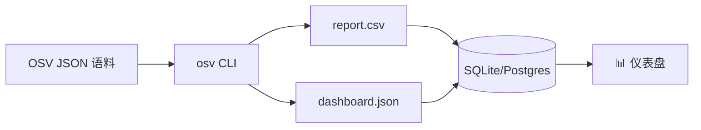

# 安全仪表盘数据源

用 CLI 产出干净的 CSV/JSON，把 OSV 漏洞数据喂进安全仪表盘（Grafana、Tableau、自建）。

---

## 架构



---

## 生成仪表盘 CSV

为每条记录抽取 ID、严重程度、受影响生态、是否有 FIX：

```bash
for f in vulns/*.json; do
  osv parse -o json "$f" | jq -r '
    [
      .id,
      (.summary // "" | tostring),
      ((.severity[0].score // "") | tostring),
      ([.affected[].package.ecosystem] | unique | join("/")),
      (if any(.references[]?; .type == "FIX") then "yes" else "no" end)
    ] | @csv
  '
done > dashboard.csv
```

**示例输出**（`dashboard.csv`）：

```csv
"GHSA-vxv8-r8q2-63xw","Potential directory traversal in Django admin","","PyPI","yes"
"CVE-2024-1234","RCE in log4j","CVSS:3.1/AV:N/AC:L/PR:N/UI:N/S:U/C:H/I:H/A:H","Maven","yes"
"CVE-2024-5678","DoS in express","","npm","no"
```

---

## 导入 SQLite

```bash
# 建表
sqlite3 dashboard.db <<'SQL'
CREATE TABLE IF NOT EXISTS vulns (
  id TEXT PRIMARY KEY,
  summary TEXT,
  cvss_vector TEXT,
  ecosystems TEXT,
  has_fix TEXT
);
.mode csv
.import dashboard.csv vulns
SQL

# 查询：每个生态有多少漏洞？
sqlite3 dashboard.db "SELECT ecosystems, COUNT(*) FROM vulns GROUP BY ecosystems ORDER BY COUNT(*) DESC;"
```

**示例输出**：

```
PyPI|42
npm|28
Maven|15
Go|8
```

---

## 生态分布（用于饼图）

```bash
for f in vulns/*.json; do
  osv parse -o json "$f" | jq -r '.affected[].package.ecosystem'
done | sort | uniq -c | sort -rn | awk '{print $2","$1}' > ecosystem-pie.csv
```

`ecosystem-pie.csv`：

```csv
PyPI,42
npm,28
Maven,15
Go,8
```

直接喂给 Grafana 的饼图面板，或在 Excel/Sheets 中打开。

---

## "是否有修复？"报告

哪些漏洞有已知修复？

```bash
for f in vulns/*.json; do
  has_fix=$(osv filter -r FIX -o json "$f" | jq 'if (.references | length) > 0 then "yes" else "no" end' -r)
  id=$(osv parse -o json "$f" | jq -r '.id')
  echo "$id,$has_fix"
done | sort > fix-status.csv
```

---

## 定时调度（cron）

每晚刷新仪表盘：

```cron
# crontab -e
0 2 * * * /path/to/refresh-dashboard.sh /path/to/vulns
```

`refresh-dashboard.sh`：

```bash
#!/usr/bin/env bash
set -euo pipefail
DIR="${1:?用法: refresh-dashboard.sh <vulns-dir>}"
cd "$DIR"

for f in *.json; do
  osv parse -o json "$f" | jq -r '
    [.id, (.summary // ""),
     ((.severity[0].score // "") | tostring),
     ([.affected[].package.ecosystem] | unique | join("/"))] | @csv'
done > dashboard.csv

sqlite3 dashboard.db <<'SQL'
DROP TABLE IF EXISTS vulns;
CREATE TABLE vulns (id TEXT, summary TEXT, cvss TEXT, ecosystems TEXT);
.mode csv
.import dashboard.csv vulns
SQL
```

---

## 另见

- [实战示例：按生态聚合](/zh/guide/examples#3-按生态聚合并统计受影响包)
- [CLI 参考](/zh/guide/cli) —— 完整命令清单
- [批量扫描](/zh/use-cases/batch-scanning) —— 更深的批量模式